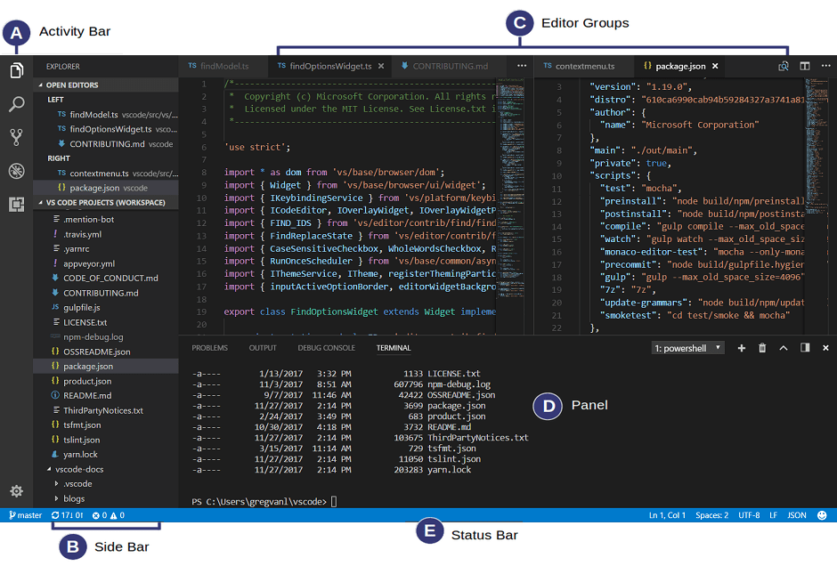
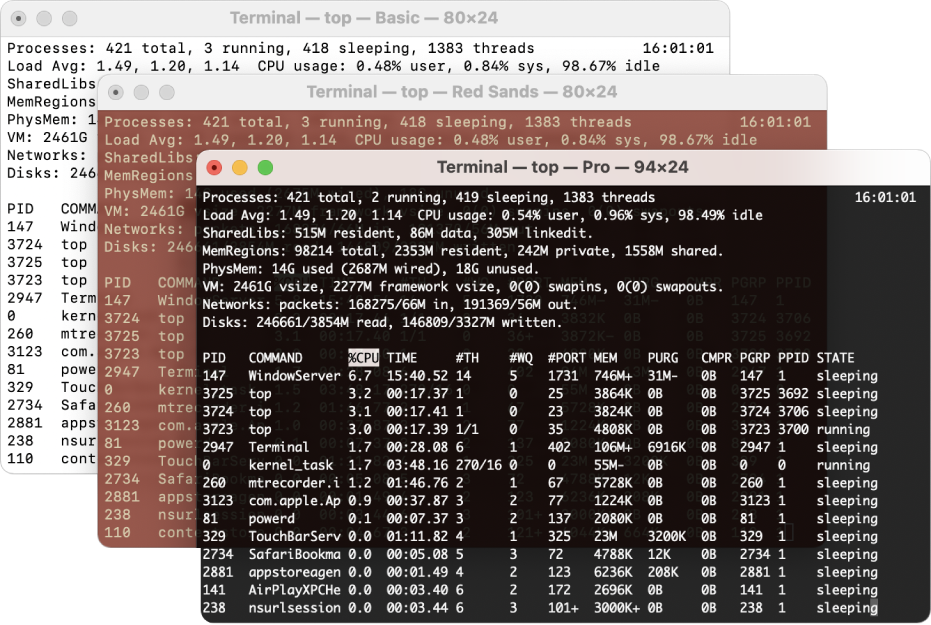

# Getting Started

## Set-up the following accounts and software

* [Google Chrome](https://www.google.com/chrome/downloads/)
* [VS Code](https://code.visualstudio.com/)
* [GitHub](https://github.com/)

## Browser


This course uses Google Chrome as the preferred browser for its robust [DevTools](https://developer.chrome.com/docs/devtools/). If you don’t already have it, please follow the installation instructions for [Google Chrome](https://www.google.com/chrome/downloads/).

It is recommended that you install the following Chrome Extensions:

* [JSON View](https://chrome.google.com/webstore/detail/jsonvue/chklaanhfefbnpoihckbnefhakgolnmc)

## Window Manager
While programming it's pretty common to need to juggle the placement of multiple windows. To speed up this process install Spectacle, a program that does this for us (and gives us a bunch of convenient keyboard shortcuts).

* Download [Spectacle](https://www.spectacleapp.com/) 
 * Next, extract it and drag the application icon into your `Applications` directory.
 * Finally, launch the app by right-clicking on the Spectacle icon and click open, follow the instructions to enable the accessibility options. 
* It will serve you well to familiarze yourself with Spectacle commands and keyboard shortcuts, like:
 * Move window to the left-half: Command+Option+LeftArrow
 * Move window to the right-half: Command+Option+RightArrow
 * Maximize a window: Command+Option+F	

## Text Editor



### What is a Text Editor?

* Text editors provide an interface for viewing and modifying text files.
* There are different kinds of text editors:
 * Terminal/command line: Vim, Emacs, GNU nano
 * Window-based: VS CODE, Sublime, Atom, TextMate, Notepad++

### Modern Text Editors

* Can open a file or directory.
* Can understand context.
 * Feature context-sensitive help.
 * May highlight errors or bad practices in your code.
 * Adapt to different file formats.
 * Provide syntax highlighting. 
* Provide extensions and plugins to add additional features to a text editor.

### Types of Text Files

* Plaintext
* Markdown
* HTML
* JavaScript
* Python
* BASH

### Get Up and Running with VS Code

1. Go [here](https://code.visualstudio.com/) to download Visual Studio Code.
2. Open the downloaded zip file.
3. Drag the unzipped `Visual Studio Code` app to your `Applications` folder.
4. Launch the application by clicking on the icon or press `Command + Spacebar` and type VS Code in the input field that appears

📕 References: 
* [Visual Studio Code Tips and Tricks](https://code.visualstudio.com/docs/getstarted/tips-and-tricks), VS Code Documentation
* [Visual Studio Code User Interface](https://code.visualstudio.com/docs/getstarted/userinterface), VS Code Documentation

### Add Packages

Visual Studio Code’s core functionality can be extended using thousands of third-party packages that can help reduce your errors, and increase your productivity. Install [VS Code Extensions](https://code.visualstudio.com/docs/editor/extension-marketplace) in the VSC extensions sidebar.

1. Click on the `Extensions` icon in the Activity Bar and search for `indent-rainbow` extension.
2. When you have found the package, click on the green `install` button.
3. You may be prompted to reload your Visual Studio Code. That’s perfectly fine!
4. After reloading, you will now have that extension installed and activated!
5. Now, try searching for and adding the `open in browser` extension as well.

## Terminal

Have you ever opened up the Terminal, then you may have wondered what to do next? You're not alone. Developers on macOS and Linux machines use Bash to interact with files and applications. Bash is a command-line interface shell program used extensively in Linux and macOS. The name Bash is an acronym for "Bourne Again Shell," developed in 1989 as a successor to the Bourne Shell.

### What is a GUI (pronounced gooey)?

There was a point when computers didn't come with a Graphical User Interface (GUI). Instead, everyone interacted with the computer using text commands in what we call a Command Line Interface (CLI).

Today, the command line still exists, even though you may have never seen it as a casual computer user. As a developer, you will regularly intereact with the command line to manage your files and tell your computer how to run the programs you write. It will greatly speed up your development process and help you take ownership of your computer at a deeper level. 

### What is a shell?

"What's a shell?" you ask? A shell is a computer program that allows you to directly control a computer's operating system (OS) with a graphical user interface (GUI) or command-line interface (CLI). Simply put, it is a program that accepts text as input and translates that text into the appropriate functions that you want your computer to run. For example, Windows 10 is based on the Windows shell that allows you to control your OS with a desktop, taskbar, and menus.

While Bash is famous for being the go-to CLI shell in Mac and Linux, Windows uses Command Prompt and PowerShell to perform the same functions as Bash. But, it's now possible to install Bash on Windows 10 to provide almost the same functionality as Bash in Mac and Linux.



📕 References: 
* [How to Install bash on Windows 10](https://hackernoon.com/how-to-install-bash-on-windows-10-lqb73yj3)
* [Terminal User Guide](https://support.apple.com/guide/terminal/welcome/mac), Apple

### Everything is a Command

First things first, on the command line, everything we enter is a command. When we hit enter, the command is executed.

### Commands Have Outputs and Side Effects

Some commands have outputs, which are displayed on the screen for us to see.

Examples of commands with outputs might be:
* `pwd`
* `ls`
* `cat <filename>`

### Command Syntax (Flags and Arguments)

Commands generally consist of three parts: the command, followed by flags (a.k.a., options), and finally, arguments.

The **command** is the first "word," e.g., `ls`, `cd`, or `touch`. It acts like a verb, which generally asks, "What do I want to do?"

Next come the **flags**. Think of these as "options" that tell the command how to do what it's about to do. 
* Sometimes you won't use any options. Other times you'll use just one, or maybe even more!
* Options usually start with one or two dashes. If the option is a letter, then use one dash (e.g., `-a`). If it's a whole word, then use two dashes (e.g., `--all`).

> [Here](http://catb.org/esr/writings/taoup/html/ch10s05.html#id2948149) are some of the single-letter flags you may encounter. Note: This is not an exhaustive list.

Finally, we have **arguments**. These are elements on which you want to perform an action. Usually these are file names, but, alternatively, they could be something like a URL.

```bash
$ touch index.html # uses the touch command

$ ls -a # uses the -a flag
```

### 🧩 Challenge: Diagram the Documents Directory

Below is a diagram of the DOM (Document Object Model). You can see it is shaped like an upside down tree. In the DOM Tree, the opening and closing `<html></html>` elements form the foundation upon which the rest of the document is built. In this case, the document is your webpage.


The files on your computer are also organized in a tree structure. In order to familiarize yourself with the files on your system, diagram the structure of your Documents directory (folder) on your computer.

1. Open your Finder (Mac) or File Explorer (Windows) application
2. Click on the Documents folder
3. Draw the contents of your Documents folder using the Tree structure.


### Paths

Let's assume a course directory with the following structure: 
```md
gsapp
├── fantastic-octo-guide/
    ├── 01-networks
      ├── exercise-01
      └── exercise-02
    ├── 02-webgl
    ├── 03-ar-vr
    └── 04-arduino
      ├── exercise-01
      └── exercise-02
└── index.html
```

#### What is a "path"?

A path is a description that tells us (or a computer) the location of a file or directory on our device.

Our terminal (shell) is always working out of one path at a time. Commands will take action in that current path (directory) unless we tell them otherwise.

All paths point to a single file or directory, but we can write paths as either **relative** or **absolute**.

#### Absolute Paths

An absolute path will always tell us exactly where a file or directory is located. A real-world example would be a mailing address. Absolute paths start with a `/` and go from the top down (least specific to most specific).

```bash
/Milky_Way/Solar_System/Earth/USA/CA/San_Francisco
```
Another more realistic example would be:

```bash
/Users/celestelayne/gsapp/fantastic-octo-guide
```
The first slash essentially means "Start at the root of the computer's file system."

Some absolute paths instead start with a `~`. This is a shortcut to the absolute path of our home directory. So, the absolute path we saw above could also be written as:

```bash
~/gsapp/fantastic-octo-guide
```

> On Macs, `~` corresponds to your user directory — `/users/your-mac-username`. On Windows, your users directory is located at `C:\Users\<username>`

#### Relative Paths

Relative paths start from the current working directory and are written with anything but `/` or `~`.

So, if we were in our home directory, the path to this lesson's directory could be written in the following ways:

```bash
gsapp/fantastic-octo-guide/01-networks                       # relative
~/gsapp/fantastic-octo-guide/01-networks                     # absolute
/Users/celestelayne/gsapp/fantastic-octo-guide/01-networks   # absolute
```

If we were in a different working directory, then this relative path would point to an entirely different folder or file.

Periods take on a special meaning when they are used in relative paths:
* `.`: One dot means "relative to the current directory."
* `..`: Two dots means "Go up to the parent directory."

So, if we're in `~/gsapp/fantastic-octo-guide/01-networks`, then the relative path `../04-arduino` means "Go up one level to the `fantastic-octo-guide` folder, then down to the `04-arduino` directory."

We can use more than one `..` to move up multiple levels. For example:

This time, if we're in `~/gsapp/fantastic-octo-guide/01-networks/exercise-01`, entering `cd ../../04-arduino` would move us up two levels to `fantastic-octo-guide`, then down one level to `04-arduino`.

### Common Commands

| Key/Command | Description 				                    | Windows |
| :---        | :---                                    | :---    
| Tab         | Auto-complete files and folder names    | 
| cd [folder]  | Change to a different directory        | cd [folder]
| cd ..        | Change to a different directory        | cd ..
| ls  | Lists the contents of a directory               | dir
| open [file]  | Opens a file                           | 
| open .  | Opens the directory                         | start .
| clear  | Clear terminal screen                        | cls
| touch [file]  | Create new (empty) file               | echo > [filename]
| pwd  | Full path to working directory                 | cd
| mkdir [dir]  | Create new directory                   | mkdir [dir] 
| cp [file] [dir]  | Copy file to directory             | xcopy [file] [dir]
| mv [file] [new filename]  | Move/Rename, e.g. mv -v [file] [dir] | ren [file] [new filename] 

### Getting Help 

There are three general ways to get help with a command.

* Add `--help` or `-h` to the end of the command (e.g., `brew --help`).
* Use the manual — or `man` — tool (e.g., `man brew`).
* Google it!!!

The first two options will display text using a program called `less`. Use the arrow keys to navigate. Type `q` to quit.

### Open Visual Studio Code from Terminal


1. With Visual Studio Code open, type the following shortcut to pull up the command pallette: `command + shift + P`
2. Enter the command `install 'code' command in PATH` and press Enter.
3. Now you will be able to type `code` in the Terminal to open Visual Studio Code.

### How?

Real-world software projects often involve many files, which are organized into folders. It's handy to be able to see all files in our project while working in our text editor. VS Code makes this easy, as it supports a project mode. To use this mode, we simply pass in a directory.

1. Navigate to the root of your project folder.
2. In the command line type `code .` and VS Code will launch with the project folder ready to edit.

```bash
code fantastic-octo-guide
```
or

```bash
cd fantastic-octo-guide
code .
```
Notice that the sidebar now has a folders section that shows all files and folders in the project. Clicking on a folder expands the view to display its contents.

3. To open VSC with a specific file, we can use the command line once again, this time passing in a file name like so:

```bash
cd fantastic-octo-guide
code index.html
```

### Directory Structure
The following is the suggested architecture of your GitHub repo for this course:

```md
fantastic-octo-guide
├── 01-networks-communciations
    ├── 01_exercise
    ├── 01_assignment
    └── README.md
├── 02-threejs
    ├── 02_exercise
    ├── 02_assignment
    └── README.md
├── 03-virtual-augmented-reality
    ├── 03_exercise
    ├── 03_assignment
    └── README.md
├── 04-arduino
    ├── 04_exercise
    ├── 04_assignment
    └── README.md
└── index.html # entry point of the website
``` 

* Navigate into the directory you create last class:
 * First, figure out where you are by typing the command to print your working directory, `pwd`.
 * Then use the `cd` command to navigate to `fantastic-octo-guide`. You should now be inside the folder called `fantastic-octo-guide`
* Create the subfolders for the course: `mkdir 01-networks 02-threejs 03-virtual-augmented-reality 04-arduino`.
* Check that you created the  folders by typing `ls`.


### Creating and Opening Files

* Double-check you’re in the root folder `/Users/yourusername/Documents/GitHub/fantastic-octo-guide`
* Create a new file using the following command: `touch index.html`
* Open the file in the text editor: `code index.html`

### Creating Local Site

Did you know that you can create web pages without being connected to the internet? Webpages are simply files, often with the extension `.html`. To preview them, just drag the file to your Chrome web browser. You’ll notice the top URL starts with `file://...` This is the indication of a local file. Local files are running on your computer, whereas when the top URL bar starts with `http://...` , it means it’s running on the internet and can be seen by anyone.

```html
<!DOCTYPE html>
<html>
  <head>
    <meta charset="utf-8">
    <title>Computational Design Workflows</title>
  </head>
  <body>
    <h1>Hello World.</h1>
  </body>
</html>
```

1. Add content to your `index.html` file
 * Open up your `index.html` file in the text editor
 * Copy and paste the above code into your `index.html`
 * Save it
2. Test that the page works locally. To do this, drag your `index.html` into your Chrome web browser. You should get something that looks like the following screenshot.


### Final Check of Mac OS Applications
* __Spectacle (for Mac):__ Open [Spectacle](https://www.spectacleapp.com/) using Spotlight, by pressing `⌘-Space` and typing Spec, and then pressing Return. It will direct you to change your Accessibility settings to allow it to control window management.
* __Terminal:__ Open Terminal using Spotlight (⌘-Space, and type Term), and then open the Preferences pane (⌘-,), choose Profiles, and then import the profile "Tomorrow Night.terminal" from the Desktop by clicking on the gear symbol at the bottom of the list of themes and choosing Import.... Then set that profile to the default by clicking on it and choosing "Default." When you open a new terminal window it should have a black background.

### 🧩 Challenge: CLI Gardening

1. Create a new directory in your home directory named `flowers`.
2. Create four directories in `flowers`: petunia, violet, marigold, and seeds.
3. Create four files in `violet`
   * marigold-seeds.txt
   * marigold-food.txt
   * violet-seeds.txt
   * petunia-bulbs.txt
4. Copy the marigold related files to the `marigold` directory
5. Move all the seeds and bulbs files to the `seeds` directory.
6. Copy the `marigold` folder to the `petunia` folder and rename the food and seeds file.
7. Remove every file from `flowers` that does not contain the word "seeds".

The end result should look like the following:
```
    .
    ├── marigold
    │   ├── marigold-food.txt
    │   └── marigold-seeds.txt
    ├── petunia
    │   ├── petunia-food.txt
    │   └── petunia-seeds.txt
    ├── seeds
    │   ├── marigold-seeds.txt
    │   ├── petunia-bulbs.txt
    │   └── violet-seeds.txt
    └── violet
        └── marigold-food.txt
```


# Git and GitHub Foundations

### Github, what is it?
At a high level, GitHub is a website and cloud-based service that helps developers store and manage their code, as well as track and control changes to their code. To understand exactly what GitHub is, you need to know two connected principles:

* Version control
* Git

### What is Version Control?
Version control is the management of changes to documents, computer programs, websites, and other collections of information. Version control provides:
* A database containing the history of changes to a set of files.
* A set of commands for managing that database.

### Why is Version Control Helpful?
* It manage changes over time.
* It aids sharing and collaboration.
* It allows for experimentation.


### What is Git?
Git is a specific open-source version control system created in 2005 by Linus Torvalds, the creator of Linux. Specifically, Git is a distributed version control system, which means that the entire codebase and history is available on every developer’s computer, which allows for easy [branching](https://www.atlassian.com/git/tutorials/using-branches) and [merging](https://www.atlassian.com/git/tutorials/using-branches/git-merge).  It can be used with any file type such as such as [Unity projects](https://unityatscale.com/unity-version-control-guide/how-to-setup-unity-project-on-github/) or [WebVR projects](https://aframe.io/), but is most often used for tracking simple codebases. 

GitHub is a Git repository hosting service. It allows developers and engineers to create remote, public-facing repositories on the cloud for free. While Git is a command line tool, GitHub provides a Web-based graphical interface.

For the following reasons, GitHub is the version control manager of choice:

* It manage changes over time.
* It aids sharing and collaboration.
* It allows for experimentation.


📕 References: [Getting Started with GitHub Desktop](https://docs.github.com/en/get-started/quickstart/hello-world), GitHub Desktop Documentation 

What is the difference between Git and GitHub? Find an answer [here](https://stackoverflow.com/questions/11816424/understanding-the-basics-of-git-and-github).

## GitHub Desktop vs GitHub in the Terminal

### Create Account

* Sign up for a [GitHub](https://github.com/) account.
* Download the [GitHub Desktop](https://desktop.github.com/) application and install it on your computer.

### GitHub Desktop


### Create Repository

Log into [github.com](https://github.com/) and create a new repository using the link under the `+` icon in the upper right of the GitHub homepage.


Name the repository. For example, I named this one `didactic-eureka`. Thanks for the recommendation, GitHub! Check the box to add a README file. This repository will be the home for all your assignments and exercises for this class. __Click the green create repository button__.


Once you’ve initialized the repository, it will take you to the home screen. __Click the green Code button__. Then select, Open with GitHub Desktop.


When you press this button, you may see an alert window asking, Open GitHub Desktop? __Click the Set up in Desktop__ button. This will launch the GitHub Desktop application.


Now…(this is important) choose a place on your computer where you want this repository to live. My local path is: `/Users/your-computer-name/Documents/GitHub/studious-umbrella`. __Click the blue Clone button__.


Yay! You’re in your local repository. GitHub Desktop provides some friendly suggestions for where to go next:

* Open the repository in your code editor (Visual Studio Code etc)
* View the files in Finder (Mac) or Command Prompt (Windows)
* Open the repository page on GitHub in your web browser

If you select, view the files in finder, you will be taken to a folder named `studious-umbrella`, this is the ‘local’ version of your github repository. It’s local address is: `/Users/your-computer-name/Documents/GitHub/studious-umbrella`. We will use this as a space to archive your projects and exercises.

### GitHub in the Terminal

_Confirm Install_

To check whether git is installed on your system, run the Terminal command:

```bash
$ which git
$ git --version
```
The output should be a directory path like `/usr/bin/git`. This is where git is installed on your machine. If you don't see any output, git is not installed on your computer.

If you don’t have it installed already, the `git --version` command will prompt you to install it.

There are also a few ways to install Git on Windows. The most official build is available for download on the Git website. Just go to [https://git-scm.com/download/win](https://git-scm.com/download/win) and the download will start automatically.

_Configure Git_

Check your Git config:
```bash
$ git config --list
$ git config user.name
```

Configuring your git settings will help GitHub track your contributions and to make it easier and smoother to commit changes. Please be sure to use the same email as the one used to creat your GitHub account.

```bash
 $ git config --global user.name "YOUR_GITHUB_USERNAME"
 $ git config --global user.email "YOUR_GITHUB_EMAIL_ADDRESS"
```
When you forget to enter a commit message in the Terminal, git opens a text editor and reminds you to add a commit message.

Run the following command in the Terminal to configure git to open VS Code instead of the default text editor, thereby setting VS Code as your new default editor:

```bash
$ git config --global core.editor "code --wait"
```

Note: Read [here](https://stackoverflow.com/questions/68975299/why-should-i-use-wait-when-selecting-my-default-editor-in-git) about why to use the `--wait` flag when selecting default editor?

📕 References:

* [Git First Time Setup](https://git-scm.com/book/en/v2/Getting-Started-First-Time-Git-Setup)
* [Setting your commit email address](https://docs.github.com/en/account-and-profile/setting-up-and-managing-your-github-user-account/managing-email-preferences/setting-your-commit-email-address)
* [Git Cheatsheet](../assets/00_images/Git-Cheat-Sheet.png)

### Demo: Git Configuration and Skills

As a class, we are going to walk through key Git skills that you will need to be successful in this course. The goal of this section is to develop your Git skills. 

You will:

  * Create a local Git repository.
  * Add files.
  * Make commits.
  * Check the repo status.
  * View history.
  * Time travel.

#### Part 1: Creating a Repo

Create a new local Git repository:
```bash
$ cd ~/Documents/Github/solid-octo-robot
$ mkdir sample-repo  
$ cd sample-repo
$ git init
```

#### Part 2: The First Commit

Add two files:
```bash
$ touch README.md hello.txt  
$ git status                  # What is an untracked file?
$ git add -A                  # Now the files are in the stage
$ git status
```

Commit the changes:
```bash
$ git commit -m "Added two files"
$ git status
$ git log
```


#### Part 3:  More Commits, and Viewing the Repo History

Edit the `hello.txt` file, and commit the following changes:

```bash
$ echo "Hello, World" >> hello.txt
$ git status
```
We now see a "modified" file, but nothing is staged. Let's add our changes to the stage:

```bash
$ git add .
$ git status
```
Now our changes are **staged** and we can do a commit:
```bash
$ git commit -m "Fixed hello.txt"
```
Let's view the repo history:
```bash
$ git log
```
* Notice all of the info in the log.
* In what order are the commits displayed?

Note: If you want to see what is in the `hello.txt` file, type the following command:
```bash
$ cat hello.txt
```
Finally, we want to push our code to the remote (github.com). The `git push` command takes two arguments:
* A remote name, for example, `origin`
* A branch name, for example, `main`

```bash
$ git push <remote-name> <branch-name>

$ git push origin main
```
If you want to check the name of your remote: `git remote -v`
If you want to check the name of your branch: `git branch`

### Independent Practice: Changes and Commits

Make some very simple changes to your file and commit them. Be sure to check your status and history as you go.

* Suggested changes:
  * Hello, Columbia University
  * Hello, GSAPP
  * Hello, CDP

### Demo: Git Configuration and Skills, cont'd...

#### Part 4: Cherry Picking

```bash
git add [filename]   
git commit  
git status  
git log
```
#### Part 5: Diffing

View unstaged differences:

```bash
git diff  

# or  

git diff [filename]   
```

View unstaged differences:
```bash
git diff --staged

# or  

git diff --staged [filename]  
```

### Glossary of Git Terminology:

* Repository: A collection of related commits that form a directed acyclic graph.
* Commit: A snapshot of the working tree at a given time (along with a message detailing what changed).
* The index (stage): A staging area where we list changes we want to commit.
* Branch: A set of commits that form a linear progression of changes.
* Master: The default name for the "main" development branch.
* Tag: An optional label on a commit.
* HEAD: The commit that is currently checked out.
* Working area: The directory and subdirectories containing the files we're currently editing.

The end.