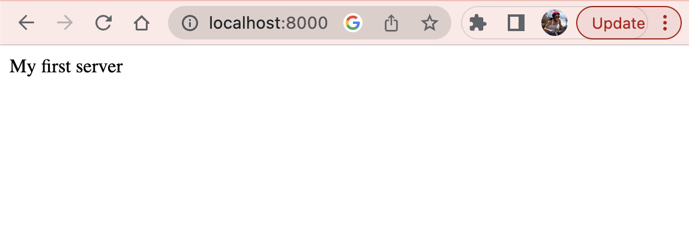
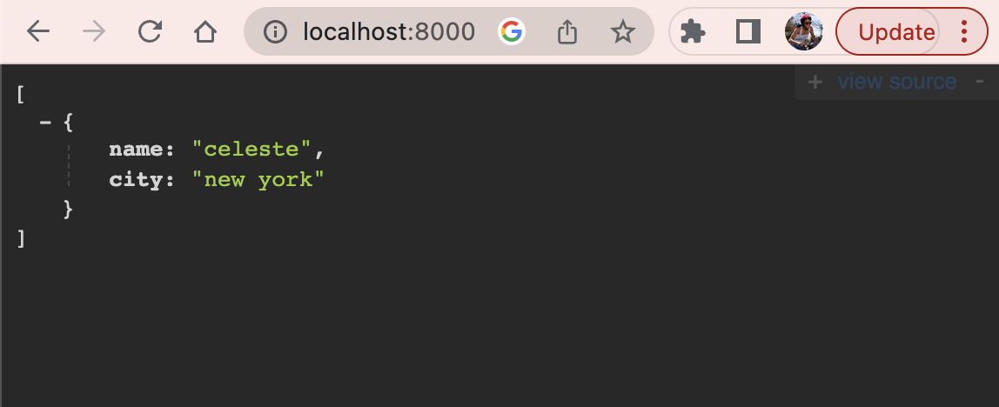
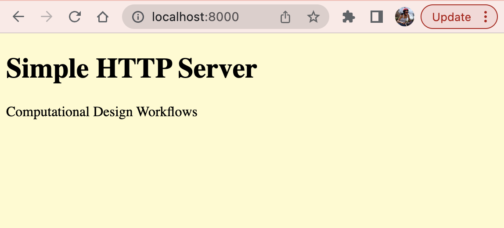
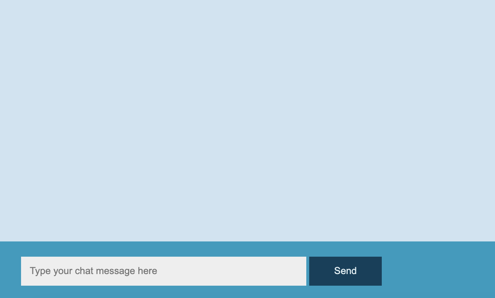
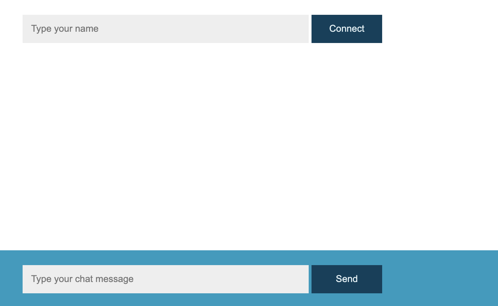
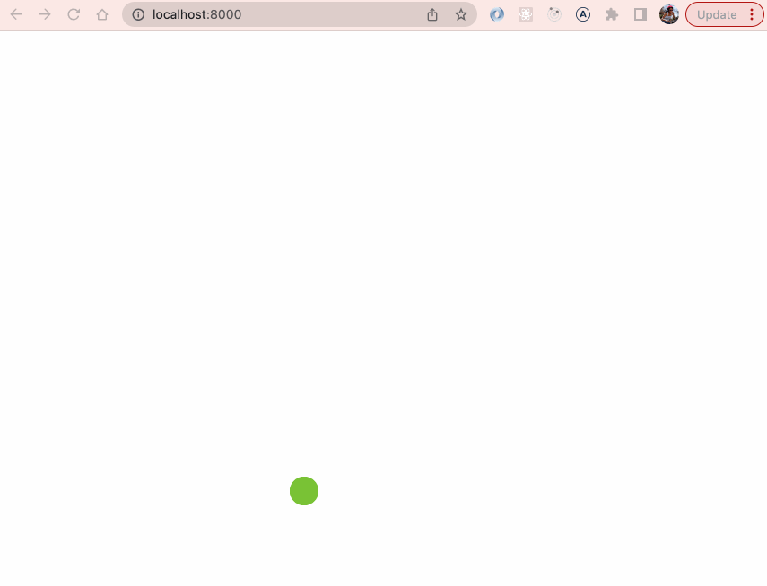
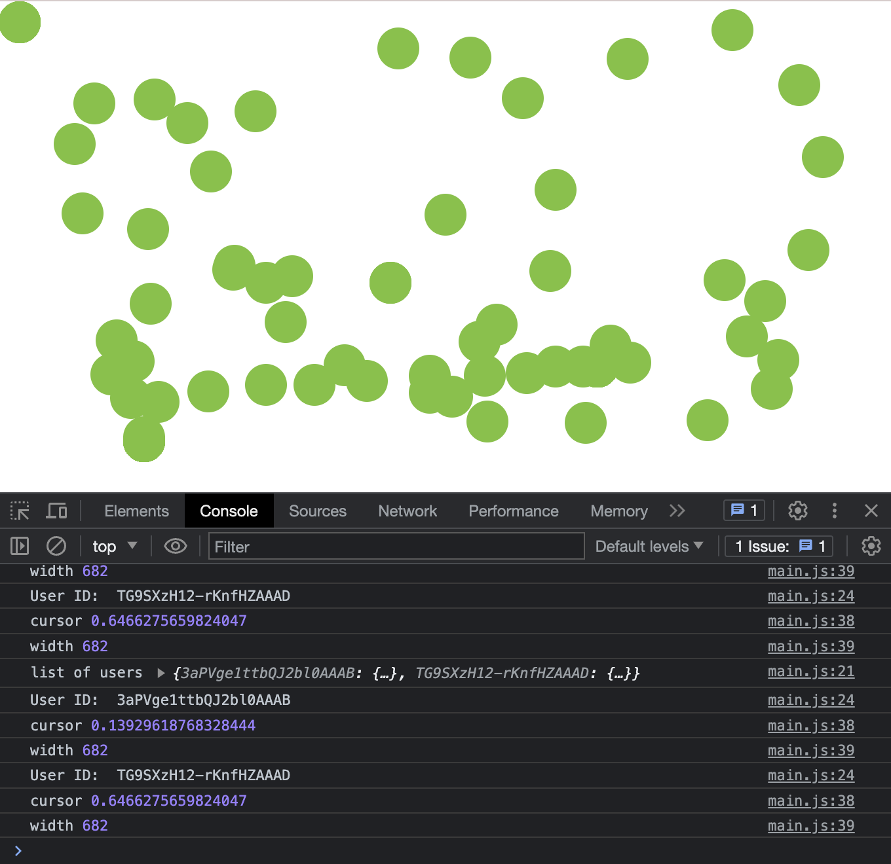
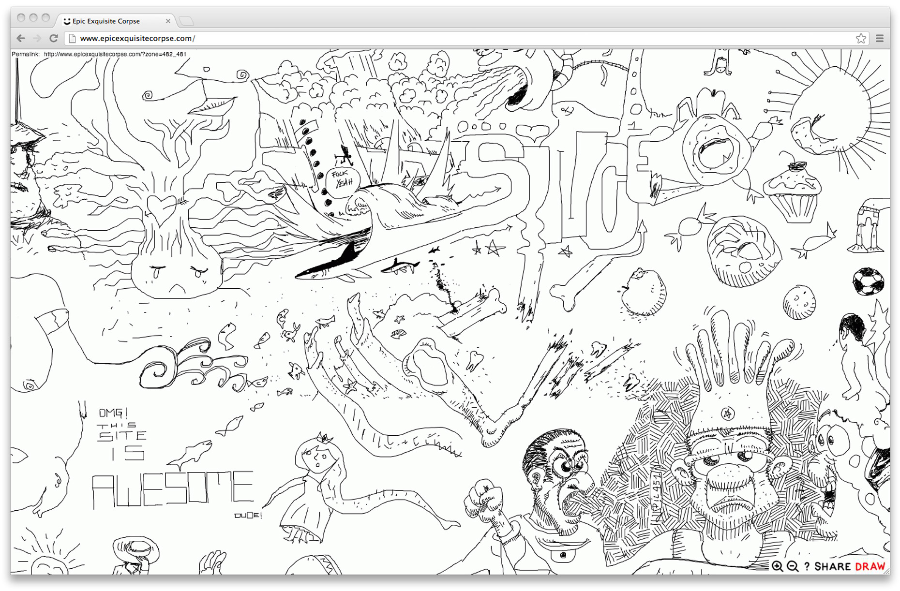

# Networks and Communications

## Servers

### What is a server?

When you visit websites on the internet, they are each hosted by a "server". A server is a computer located somewhere in the world that's connected to the internet, and that computer's job is to "serve" webpages to internet users that want to view them.

### What does it mean to program a server?

We need to write the code that handles website requests and figures out how to respond (by serving the webpages). It might need to format data into JSON, it might need to talk to a database to request a specific resource, and it might need to check if a user is authorized to see the resource they have requested.

To write server side code, is to lay out all of the possible requests that might come in and give instructions for how to handle each type of request.

### 🚧 Setting Up a Local HTTP Server

**Learning Objective:** Spinning up a local server in the Terminal

An HTTP server can be useful for testing web applications locally during development and for sharing files across multiple devices connected on the same network, like a mobile phone or tablet.

First, check to see if you have python installed on your computer and if so, which version. Open your Command Prompt (Windows) or Terminal (macOS/Linux). To check if Python is installed, enter one of the following commands:

```bash
$ python --version
# If the above fails, try:
$ python3 --version
```
The command above should return a version number, such as:
```bash
$ Python 2.7.16
``` 
If you do not have Python installed on your system, you will need to [download it here](https://www.python.org/downloads/). After installing, close your current Command Prompt Window and open a new one. 

Navigate into your project directory:
```bash
$ cd networks
``` 
If you are running version 2 (i.e Python 2.x.x) type the following command and then hit enter:
```bash
$ python -m SimpleHTTPServer
```
If you are running version 3 (i.e. Python 3.x.x) type the following command and then hit enter:
```bash
$ python -m http.server # on Windows you may have to use python instead of python3
$ python3 -m http.server # on Mac you may need to use python3
 ```
You should see the following output from the Terminal window:
```bash
Serving HTTP on 0.0.0.0 port 8000 ...
```
You can run a python http server on any port, the default port is 8000. To run it on a different port, just modify the command:
```bash
$ python -m SimpleHTTPServer 8080
```
Open a browser window and type in the URL:
```bash
http://localhost:8080/
```
Python SimpleHTTPServer supports only two HTTP methods - GET and HEAD. So it’s a good tool to share files with people who are in the same network. To do this, you need your IP address. You can get this information by opening a new Terminal window and typing the following command:
```bash
$ ipconfig getifaddr en0
```
This format `ipconfig getifaddr <interface name>` means:
* `ipconfig` means internet protocol configuration
* `getifaddr` means get interface addresses
* `en0` represents the wifi interface

You should see the following output from the Terminal window:
```bash
$ 192.168.1.153
```
On a MacOS, you can also find your computer’s IP address by pressing the ​option key and clicking on the wifi icon

Now that you know the ip address of your machine, replace localhost with your ip address and then share it with your friend.
```bash
http://192.168.1.153:8080/
```
Note that if there is any index.html file then it will be served to the browser, otherwise directory listing will be shown as in above image.

To stop the server, type `Control + C`.

***

### 🚧 Setting up an HTTP web server

Open a Terminal window and create a new folder, then navigate to the newly created folder:
```bash
$ mkdir simple-http-server
```
Change into the directory:
```bash
$ cd simple-http-server
```
Create a `server.js` file:
```bash
$ touch server.js
```
Open the file in your text editor.

Load the http module, it has a function to create a server.
```js
const http = require("http");
```
Define two constants
```js
const host = 'localhost';
const port = 8000;
```

The value localhost is a special private address that computers use to refer to themselves. It’s typically the equivalent of the internal IP address `127.0.0.1` and it’s only available to the local computer.

The port is a number that servers use as an endpoint or “door” to our IP address. In our example, we will use port 8000 for our web server. 

When we bind our server to this host and port, we will be able to reach our server by visiting http://localhost:8000 in a local browser.

Next, we create a function to handle an incoming HTTP request and return an HTTP response. This function must have two arguments, a request object and a response object

```js
const requestListener = function (req, res) {
    res.writeHead(200); // sets the HTTP status code of the response
    res.end("My first server!"); // writes the HTTP response back to the client who requested it
};
```
Finally, we create our server:
```js
const server = http.createServer(requestListener);
server.listen(port, host, () => {
    console.log(`Server is running on http://${host}:${port}`);
});
```
Let’s now run the server we’ve just created:
```bash
$ node server.js
```
In the console, we will see the following output:
```bash
Server is running on http://localhost:8000
```
Now, open the web browser with the URL and you should see:



<details>
 <summary>🧩 Challenge:</summary>

  <h3>You are able to return different Kinds of Content – JSON, CSV, HTML. For this challenge, let's return some JSON (JavaScript Object Notation) to the webpage.</h3>

  <code>

    const data = [{
      "name": "celeste",
      "city": "new york"
    }]

    res.end(JSON.stringify(data))
  </code>

  <p>You should see the following:</p>
  
</details>

Technically we can just drop some HTML in the `res.end()` method which writes the HTTP response back to the client that requested it (in this case its the web browser). This function will return any data the server has to return. In this case, its text data (with an HTML format).

The response we return from a web server can take a variety of media types – text, images, application, audio, video and multipart. This example will focus on returning text-based formats and in order to do that we need to:

* Set the Content-Type header in our HTTP responses with the appropriate value.
* Ensure that `res.end()` gets the data in the right format. 

Let’s start by modifying the `requestListener()` function to return the appropriate Content-Type header. Remember, `setHeader()` takes two arguments, name and value:
```js
res.setHeader('Content-Type', 'text/html')
```
Then set the HTTP status code of the response.
```js
res.writeHead(200);
```
To serve HTML files, we load the HTML file with the `fs` module and use its data when writing our HTTP response. Create an HTML file with minimal content. 
```html
<!DOCTYPE html>
<html lang="en">
<head>
 <title>HTTP Server</title>
 <style>
   body {
     background: lemonchiffon;
   }
 </style>
</head>
<body>
 <div>
   <h1>Simple HTTP Server</h1>
   <p>Computational Design Workflows</p>
 </div>
</body>
</html>
```

Next, import the `fs` module:
```js
const http = require("http");
const fs = require('fs').promises;
```
The fs module contains a readFile() function that we’ll use to load the HTML file. `readFile()` takes one argument:
```js
fs.readFile(__dirname + "/index.html")
```
The special variable `__dirname` has the absolute path of where the Node.js code is being run. Then, we append the HTML file we want rendered. If the `readFile()` promise successfully resolves, it will return data which we have named, content – the HTML file data. Use `.then()` method to handle the successfully resolved data.

Inside the `.then()` method,set the Content-Type header, write the status code to indicate success and send the client (web browser) the HTML page we served it up.
```js
const requestListener = (req, res) => {
 fs.readFile(__dirname + "/index.html")
 .then(content => {
   res.setHeader("Content-Type", "text/html")
   res.writeHead(200)
   res.end(content)
 })
}
```
In case the `fs.readFile()` method fails, we use the `catch()` method to handle the rejection. The `catch()` method accepts the error that `fs.readFile()` returns. Set the status code to 500 signifying that an internal error was encountered, and returns the error to the user.
```js
 .catch(err => {
   res.writeHead(500)
   res.end(err)
   return
 })
```
Open the web browser to http://localhost:8000. 



You have now returned an HTML page from the server to the user. 

### 💡 Solution: [simple-http-server](./simple-http-server/)

***

### 🚧 Setting up an Express web server

Learning Objective: Spinning up a web server using the Express JavaScript framework

#### Directory and File Setup

Open a Terminal window and create a new folder, then navigate to the newly created folder:

```bash
$ mkdir simple-express-server
```
Change into the directory and run `npm init`. [npm](https://www.npmjs.com/) – or "Node Package Manager" – is the default package manager for JavaScript's runtime Node.js. NPM consists of two main parts:
* The Command Line Interface, and
* The online repository of libraries (JavaScript packages)

For more detailed information about npm, [read this article](https://www.freecodecamp.org/news/what-is-npm-a-node-package-manager-tutorial-for-beginners/).

```bash
$ cd simple-express-server

$ npm init -y # create package.json for the project
```
> Note: The first command initializes an empty Git repository and the second walks you through creating a `package.json` file. The structure of the backend directory should now look like this:

```md
simple-express-server
├── package.json
└── .git
```

Install the `express` package:
```bash
$ npm install express
```

[Node Package Manager (npm)](https://www.npmjs.com/) keeps track of the various libraries and third-party packages of code used in a Node project. `npm install express` tells the Node Package Manager (npm) to download and install the Express library for this project to use. The above two npm commands will be necessary for every new web application that uses Express. 

Notice that a new folder called `node_modules` was created. Open it up and you'll see that there is an express folder. `node_modules` is where the dependencies in `package.json` are downloaded to. If you look at `package.json` again, you'll see express has been added as a dependency for this project.

Open the project directory in VS Code:
```
$ code .
``` 

### Server Setup

Now that Express is installed, create a server.js file:
```bash
$ touch server.js
```

Add boilerplate code found [here](https://expressjs.com/en/starter/hello-world.html):
```js
// grab the main Express module from package installed
const express = require('express')
// create the app variable and call the Express function
const app = express()
// establish which port you’d like to use
const port = 3000

// define route handler for GET requests to the server
app.get('/', (req, res) => {
  res.send('Hello World!')
})

app.listen(port, () => {
  console.log(`Example app listening on port ${port}`)
})
```
In the Terminal, run `node server.js`:
```
$ node server.js
``` 
You should see: Example app listening on 3000 in the Terminal window. When using Express, our server-side console logs show up in the Terminal window. Now visit http://localhost:3000/ in your browser window and you should see "Hello World!".

> Note:  Every time you make a change in your server code and want it to run, you need to end the previous server and run `node server.js`.

Let’s test this by placing a console.log() with the req and res parameters inside the app.get() method for the `/` path. (The / path is often called the "root" path.) Restart the server and briefly check out what the `req` and `res` parameters return to the Terminal.

```js
app.get('/', (req, res) => {
  console.log(req, res)
  res.send('Hello World!')
})
```
### Routes

Once the web server is listening, it can respond to requests. Routes are how a server side application responds to the client request of a particular HTTP endpoint. An HTTP endpoint is a URL in the web application, examples include:

```bash
https://localhost:3000/fruits
```
Let's look at the anatomy of the above URL:
* https is the protocol
* localhost is the hostname 
* 8000 is the port
* `/fruits` is the path

Express uses the `app.get()` method to register routes to match GET requests. `app.get()` takes two parameters:
* The first parameter is the route (or path). In this case, it’s the site root /.
* The second parameter is a callback function to handle the request and send a response
  * The callback function takes two parameters: request and response.

Let’s build two more routes into our application:

| Request Type  | Request Path  | Response  |
| ------------- |:------------- | :-----    |
| GET           | /             | Hello World     |
| GET           | /fruits       | apples, bananas, oranges     |
| GET           | /animals      | cats, birds, zebra     |

When the server receives a GET request at `/`, we will use a route to define the appropriate functionality and path. The path is the part after the hostname and port number. GET requests are used for retrieving resources from a server.

In the server lets set up a couple dummy datasets (sometimes called seed data) and serve them when you hit the url, `/fruits` and `/animals` in the web browser. To have this seed data be accessible, we need to set up a route to serve it.


```js
// dummy dataset
const fruits = ['apples', 'bananas', 'oranges'] // this is an array
const animals = ['cats', 'birds', 'zebra']

// routes
app.get('/', (req, res) => {
  res.send('Hello World!') // unstyled
  res.send("<h1>Welcome to the chat app</h1>") // styled
})

app.get('/fruits', (req, res) => {
  // send all the fruit
  res.json(fruits)
})

app.get('/animals', (req, res) => {
  // send all the animals
  res.json(animals)
})
```
Add an `app.get()` method for the path `/fruits`. Inside the new route, use `res.json(fruits)` to respond with some JSON containing all the fruit from our fruits variable. Do the same for the `/animals` route.

> Restart the server and you should see the fruit when hit http://localhost:3000/fruits

Note: The `res.send()` and `res.json()` methods are identical when an object or array is passed.


<details>

  <summary>🧩 Challenge:</summary>

  <h3> Load an HTML page on the root route called `index.html`. Then, add a second route called `/about` and load a separate HTML called `about.html`. The `about.html` page should include a short bio about yourself.</h3>

  <code>

    app.get('/about', (req, res) => {
      res.send('My name is Celeste')
    })
  </code>

</details>


### Serving Static Files

In order to serve up static files such as images, stylesheets and client side javascript, Express provides a middleware function called, `express.static`. Static files are those that a client downloads from a server. 

A common practice in the development of a web application is to store all static files under the `public` directory in the root of a project. We can serve this folder to serve static files by adding this snippet of code to our `server.js` file:
```
app.use(express.static('public'));
```
Make a directory in your project called `public`. Then, `cd` into the `public` folder and create three new files:
```bash
$ mkdir public
$ cd public
$ touch index.html styles.css app.js
```
The directory structure should look like the following:
```md
simple-express-server
├── public/
    ├── app.js
    ├── styles.css
    └── index.html
├── server.js
├── package.json
└── .git
```
In the `index.html` file, add the boilerplate for a basic webpage:
```html
<!DOCTYPE html>
<html lang="en">
<head>
    <title>Express Server</title>
</head>
<body>
    <!-- code in here -->
</body>
</html>
```
Next, use the `link` element to connect the `style.css` file to the `index.html` file.
```html
<!DOCTYPE html>
<html lang="en">
<head>
    <title>Express Server</title>
    <link rel="stylesheet" href="styles.css">
</head>
<body>
    <!-- code in here -->
</body>
</html>
```
In the `styles.css` file add the following to change the color of the webpage:

```css
body {
  background: yellow;
}
```
The webpage should now be yellow.

Finally, the `app.js` file and add a `console.log("Sanity Check: JS is working!")` to the file so that it appears in your browser developer tools console (Command + Option + i). 

```html
<!DOCTYPE html>
<html lang="en">
<head>
    <title>Express Server</title>
    <link rel="stylesheet" href="styles.css">
</head>
<body>
    <!-- code in here -->
    
</body>
</html>
```

### 💡 Solution: [simple-express-server](./simple-express-server/)

***

# Web Sockets

WebSocket is a communications protocol used to send and receive data on the internet. It maintains a persistent two-way connection between the browser and the server.

Sockets allows us to create real-time, bi-directional (two-way) communication between web browsers (client) and a Node.js server. They do this by keeping a socket open on both the client and the server for the duration of the conversation/communication. The data can be text messages for a chat application, mouse positions for a collaborative drawing app or the position of a player in a multi-user game.

### 🚧 Build a chat application

[Socket.IO](https://socket.io/docs/v4/) is a JavaScript library that allows the server to push information to the client in real time, when events occur on the server. It's built on top of the [Websockets API](https://developer.mozilla.org/en-US/docs/Web/API/WebSockets_API). We'll be using the socket.io library on both our client and NodeJS server. 

Some use cases for Websockets and socket.io include chat applications, notifications, online games, data visualization boards, live maps, collaboration applications or social media feeds in which a user's page receives messages or posts from other users without needing the user to refresh the page.

### What are we building?



#### Directory and File Setup

```md
simple-chap-app
├── node_modules/
   └── express/
├── public/
    ├── app.js
    ├── styles.css
    └── index.html
├── server.js
├── package.json
└── .git
```

### Server Setup

Create a new project folder and navigate to this newly created folder:
```bash
$ mkdir simple-chap-app && cd simple-chap-app
```
Create a package.json for the application and install Express:
```bash
$ npm init -y # create package.json for the project
$ npm install express
```
Remember, the server is responsible for serving the HTML, CSS and JS files, starting the Socket.io connection and receiving and broadcasting events to clients. Create a server.js file in the root folder and a public folder to serve up the client side files:
```js
const http = require("http")
const express = require("express")

const app = express()
const port = process.env.PORT || 8000;

app.use(express.static('public'));

const server = http.createServer(app)

server.listen(port, () => {
    console.log(`Server working on port ${PORT}`)
})
```
Install a library called [nodemon](). nodemon is a tool that helps develop Node.js based applications by automatically restarting the node application when file changes in the directory are detected. 
```bash
$ npm install --save-dev nodemon
```

Add a start script to the `package.json` that executes the `server.js` file using nodemon:
```js
"scripts": {
  "start": "nodemon server.js"
},
```
Now, in the Terminal, run `npm start` to launch the Node application. Navigate to `http://localhost:8000`

### Serving HTML

Currently, we are just passing in a string of HTML to the res.send() method. Let’s send an HTML file. To store your files on the client-side, create a public directory.

```bash
$ mkdir public
$ touch public/index.html public/main.js public/styles.css
```
📕 References: [How to serve static files in Express](https://www.digitalocean.com/community/tutorials/nodejs-serving-static-files-in-express), Digital Ocean

Create an `index.html` file that includes a form and an element to append the text to the webpage. This file, along with the `style.css` and `main.js` files go inside the `public` folder.

```html
<!DOCTYPE html>
<html lang="en">
<head>
  <title>Simple Chat Application</title>
</head>
<body>
<div class="container">
  <main class="chat-container"></main>
  <form>
    <input type="text" class="chat-input" placeholder="Type your chat message here">
    <button>Send</button>
  </form>
</div>
</body>
</html>
```

Serve up static files such as images, CSS, client side javascript and HTML with the  `express.static` built-in middleware function.
```js
app.use(express.static('public'));
```

### Listening for websocket connections on the server

First, set up the socket library on the server by running the following command from the Terminal:
```bash
$ npm install socket.io
```
This command installs the module and adds the dependency to the package.json file. 
```js
 "dependencies": {
   "express": "^4.18.2",
   "socket.io": "^4.6.2"
 }
```
With the io.connection function we can detect a new connection and log a message to the console including the socket object, which contains some information from the client.

Modify the `server.js` file to initialize a new instance of the socket library:
```js
const { Server } = require('socket.io')
const io = new Server(server);
```
Then, listen on the `connection` event for incoming sockets and log them to the console:
```js
io.on('connection', socket => {
  console.log('user connection')
});
```
### Listening for messages on the client

Modify the `index.html` file by adding the socket library (we’re using the CDN instead of downloading it to our directory) and the custom main.js file (this is where we will be writing our client side code to emit and handle events from the chat):

```html
<!DOCTYPE html>
<html>
  <head>
    <title>Simple Chat Application</title>
    <!-- custom CSS files -->
    <link rel="stylesheet" href="style.css">
  </head>
  <body>
<div class="container">
  <main class="chat-container"></main>
  <form id="form">
    <input type="text" class="chat-input" placeholder="Type your chat message here">
    <button>Send</button>
  </form>
</div>
  </body>
  <!-- socket.io library -->
  <script src="https://cdn.socket.io/4.5.4/socket.io.min.js"></script>
  <!-- custom javascript file -->
  <script src="main.js"></script>
</html>
```
Inside the `main.js` file, connect the client to the socket instance running on the host that served the page (i.e. the server we just created) via the public folder:

```js
const socket = io();
``` 
This is the minimum setup to get the socket.io connection working. Now, we can send and receive messages to and from the server. 

Let’s make it so that when the user types in a message, the server gets it as a chat message event. First, query the webpage for the form, input fields and message list. Then, make a connection with the server from the client side so users can send data to the server:

```js
const chatForm = document.querySelector('.chat-form');
const chatInput = document.querySelector('.chat-input');

socket.on(`connection`, () => {
  // see this line in the browser console
  console.log(`User connected on: ${socket.id}`)
})
```

### Listening for messages [from the client] on the server

Now that we have a connection established between the client and the server, we want to send messages from the server to the user (client) by generating a socket using socket.on() inside the connection. In the `server.js`, listen for message events on the server and log them to the Terminal:

```js
const { Server } = require('socket.io')
const io = new Server(server);

io.on('connection', socket => {
  console.log('user connection')
  socket.on('message', message => {
    console.log(`Received message from client: ${message}`)
  })
});
```
Now data can be sent from any side so that a connection is generated between server and client. 

### Sending messages [from client] to the server

Then, add an event listener to the form that listens for a submit event and runs an event handler on submission called, sendMessageToServer():

```js
const sendMessageToServer = (event) => {
  event.preventDefault()
  if(chatInput.value){
    console.log(chatInput.value) // see this line in the browser console
    socket.emit('message', message)
  }
  chatInput.value = ""
}
```
In the event handler, send a message with the socket.emit() event.
```js
chatForm.addEventListener('submit', sendMessageToServer)
```

### Forward messages from client to all connected clients

There are a couple ways to send events to all the connected users (clients), using io.sockets.emit() or io.emit()
```js
socket.on('message', message => {
  console.log(`Received message from client: ${message}`)
  io.sockets.emit('message', message)
})
```

[show screenshot of browser window]

To send events to all the connected clients except the sender:
```js
socket.on('message', message => {
  console.log(`Received message from client: ${message}`)
  socket.broadcast.emit('message', message)
})
```

[show screenshot of browser window]

#### Handling messages from the server

```js
socket.on(`connection`, () => {
  // see this line in the browser console
  console.log(`User connected on: ${socket.id}`)
})
```
### 💡 Solution: [simple-chat-app](./simple-chat-app/)

***

## 🚧 Build a chat application with named participants



You can ask the user for their name in a couple ways: (1) using the [window.prompt()](https://developer.mozilla.org/en-US/docs/Web/API/Window/prompt) method, or (2) building a form to gather the users’ name.

### [ 1. ] Using window.prompt()

In the `main.js` file, store the prompt window in a variable:
```js
const username = prompt("Please enter a username: ", "")

const sendMessageToServer = (event) => {
  event.preventDefault()
  if(input.value){
    addMessage(`${username} ${input.value}`) // argument
  }
}
```

Then create a function called `addMessage()` that takes the username and input value passed in as a single argument, and sets it as the element’s text content. 
```js
const addMessage = (message) => { // parameter
  const li = document.createElement("li")
  li.textContent = message
  message.appendChild(li)
}
```

### 💡 Solution: [chat-app-with-names](./chat-app-with-names/)


### 🧩 Challenge: Make a copy of the simple chat application and build an HTML form to gather the users' name.

## 🚧 Build a shared cursor app

### What are we building?



### Directory and File Setup

```md
shared-cursor-app
├── node_modules/
   └── express/
├── public/
├── package.json
├── server.js
└── .git
```

Create a new folder to serve as the root directory of this project. Navigate to the folder and and initialize a new project but running the following commands:

```bash
$ mkdir shared-cursor-app && cd shared-cursor-app
$ npm init --yes # creates the package.json file
```
### Server Setup

Install the `express` package and create a server.js file:
```bash
$ npm install --save express
$ touch server.js
```
Add the boilerplate Express code to the server.js file:
```js
const http = require("http")
const express = require("express")

const app = express()
const port = process.env.PORT || 8000;

const server = http.createServer(app)

app.use(express.static('public'));

server.listen(port, () => {
    console.log(`Server working on port ${port}`)
})
```
Add a start script to the package.json that executes the `server.js` file using nodemon:
```js
"scripts": {
  "start": "nodemon server.js"
},
```
Now, in the Terminal, run `npm start` or `node server.js` to launch the Node application. Navigate to `http://localhost:8000`

### Serving HTML

Currently, we are just passing in a string of HTML to the res.send() method. Let’s send an HTML file. To store your files on the client-side, create a public directory.

```bash
$ mkdir public
$ touch public/index.html public/main.js public/styles.css
```

Inside the `index.html` file, place a div element that has a class called container. Connect the corresponding styles.css and main.js files:

```html
<!DOCTYPE html>
<html lang="en">
<head>
  <title>Shared Cursor Application</title>
  <link rel="stylesheet" href="styles.css">
</head>
<body>
  <div class="container"></div>

  <script src="main.js"></script>
</body>
</html>
```

### Listening for websocket connections on the server

First, set up the socket library on the server by running the following command from the Terminal:
```bash
$ npm install socket.io
```
This command installs the module and adds the dependency to the package.json file. 
```js
 "dependencies": {
   "express": "^4.18.2",
   "socket.io": "^4.6.2"
 }
```
With the io.connection function we can detect a new connection and log a message to the console including the socket object, which contains some information from the client.

Modify the `server.js` file to initialize a new instance of the socket library:
```js
const { Server } = require('socket.io')
const io = new Server(server);
```
Then, listen on the `connection` event for incoming sockets and log them to the console:
```js
io.on('connection', socket => {
  console.log('user connection')
});
```
### Listening for messages on the client

Modify the `index.html` file by adding the socket library (we’re using the CDN instead of downloading it to our directory) and the custom main.js file (this is where we will be writing our client side code to emit and handle events from the chat):
```html
<!DOCTYPE html>
<html>
  <head>
    <title>Simple Chat Application</title>
    <!-- custom CSS files -->
    <link rel="stylesheet" href="style.css">
  </head>
  <body>
<div class="container">
  <main class="chat-container"></main>
  <form id="form">
    <input type="text" class="chat-input" placeholder="Type your chat message here">
    <button>Send</button>
  </form>
</div>
  </body>
  <!-- socket.io library -->
  <script src="https://cdn.socket.io/4.5.4/socket.io.min.js"></script>
  <!-- custom javascript file -->
  <script src="main.js"></script>
</html>
```
Inside the `main.js` file, connect the client to the socket instance running on the host that served the page (i.e. the server we just created) via the public folder:

```js
const socket = io();
``` 
This is the minimum setup to get the socket.io connection working. Now, we can send and receive messages to and from the server. 

#### Shared Cursor Server

In the previous project, we forwarded messages between two agents. In this project we will keep track of some **state** data: the x and y positions of each connected client. In JavaScript, state describes the status of the entire program or an individual object. In this case, the state we are keeping track of is the location of the cursor on the page. Every time you move the cursor the state (location) changes / updates.

Similar to the chat application, store the x and y positions of each connected user in a global object. Create a global variable to store this information:

```js
const users = {};
``` 
Every time a user connection is made, the user’s socket id, x-position and y-position will be stored in the lookup object called, `users`.
```js
io.on('connection', socket => {
  console.log('user connection')
  // create value for connected socket id
  users[socket.id] = {
    id: socket.id,
    x: Math.random(),
    y: Math.random(),
  };
});
```
Then, when the user disconnects, delete their data from the global variable:
```js
socket.on('disconnect', () => {
  console.log('user disconnected');
  delete users[socket.id];
});
```
Next, let’s handle the `state_update`. Listen to the update event of that new socket connection, and update the x and y positions to the new positions:
```js
socket.on('state_update', userData => {
  users[socket.id].x = userData.x; // this data is coming from the client
  users[socket.id].y = userData.y
})
```
Add a `console.log(userData)` to the `state_update` event and you should see something like the following (the x- and y- positions being updated as you move your mouse on the webpage) in your Terminal:

```bash
state_update { x: 0.3958333333333333, y: 0.8493589743589743 }
state_update { x: 0.3958333333333333, y: 0.8493589743589743 }
state_update { x: 0.3958333333333333, y: 0.8509615384615384 }
state_update { x: 0.3958333333333333, y: 0.8509615384615384 }
state_update { x: 0.3958333333333333, y: 0.8509615384615384 }
```

Finally, broadcast the global users object to all the connected clients – within a given interval. Start the interval once the server starts, and it should automatically sync the users object to all the connected clients:

```js
server.listen(port, () => {
  console.log(`Socket.io server listening on port ${port}`)
  setInterval(() => {
    socket.emit('state_update', users)
  }, 100)
})

```
Using the [setInterval()](https://developer.mozilla.org/en-US/docs/Web/API/setInterval) method, executes the code snippet and sends the updated state (cursor location) to all the connected clients.

### Shared Cursor Client

Create an [event listener](https://developer.mozilla.org/en-US/docs/Web/API/EventTarget/addEventListener) to the window object that calls the `handleMouseMove()` event handler when the mousemove event is fired.
```js
window.addEventListener(`mousemove`, e => handleMouseMove(e));
```
The handleMouseMove event handler is a function that will send a `state_update` event to the server via the `socket.emit()` method, along with the relative mouse position:

```js
const handleMouseMove = event => {
  if(socket.connect){
    let cursorState = {
      x: event.clientX / window.innerWidth,
      y: event.clientY / window.innerHeight
    }
  // sending updated cursor location to the server
  socket.emit('cursor_update', cursorState)
  }
}
```
The server will broadcast cursor positions to all connected clients. Allowing you to visualise the other connected cursors in your own client app. Write the `state_update` event:

```js
socket.on('cursor_update', users => {
  console.log('list of users', users)
})
```
Reload the browser. You should see an incoming object, containing unique ids and coordinates:
```bash
{ 
  IxKy-dixpwpaBqjzAAAB : {
    id: 'IxKy-dixpwpaBqjzAAAB', 
    x: 0.5219907407407407, 
    y: 0.9855769230769231
  }
}
```
We are going to iterate over these users with a [`for...in`](https://developer.mozilla.org/en-US/docs/Web/JavaScript/Reference/Statements/for...in) loop, and move the cursor.

```js
socket.on('cursor_update', users => {
  console.log('list of users', users)
  // we need to iterate over this list of users
  for (const userId in users) {
    console.log('User ID: ', userId) 
  }
})
```
To move the cursor, we will check to see if a cursor with that `userId` already exists on the page. If not, we will create a new cursor:
```js
  for (const userId in users) {
    console.log('User ID: ', userId) 
    // if cursor exists then grab it
    let cursor = document.querySelector(`#cursor-${userId}`);
    // check if no cursor exists
    if(!cursor){
      // create one
    }
  }
```
To create a new cursor, we use the [createElement()](https://developer.mozilla.org/en-US/docs/Web/API/Document/createElement) method. Then, we add the `.cursor` class that we will customize in the `styles.css` file. Add that style to the cursor using `classList.add()` method. Use the [setAttribute()](https://developer.mozilla.org/en-US/docs/Web/API/Element/setAttribute) method to create a dynamic id on the cursor. Finally, append the cursor to the body of the webpage. 

```js
// if no cursor exists
if(!cursor){
  // then create one
  cursor = document.createElement('div')
  // add a class of cursor ... see style.css file for details
  cursor.classList.add('cursor')
  // 
  cursor.setAttribute('id', `#cursor-${userId}`)
  document.body.appendChild(cursor)
}
```
Now, we want to update the location of the cursor on the webpage using dynamic styling. Set the left (and right) positions on the cursor element by applying the style property. 

```js
  cursor.style.left = `${users[userId].x * window.innerWidth}px`
  cursor.style.top = `${users[userId].y * window.innerHeight}px`
```
Remember, 

### Style the Cursor
Add some CSS to the cursor element:
```css
.cursor {
  position: absolute;
  width: 2rem;
  height: 2rem;
  background: #79C234;
  border-radius: 50% 50%;
  transition: top .1s, left .1s; /* add a little animation */
}
```
Now, test the app. You should see a bunch of random green circles on the screen.



### Remove disconnected cursor

This is still not what we want. When a client disconnects, it's cursor will remain on your screen. You'll need to remove that div from the DOM.

Right now, in the `state_update` event we **only** get the connected clients. So, let's compare the currently connected clients.

### 💡 Solution: [shared-cursor-app](./shared-cursor-app/)

### 🧩 Challenge
Create a shared drawing app based on [Exquisite Corpse](https://www.xavierbarrade.com/epicexquisitecorpse):



The end.