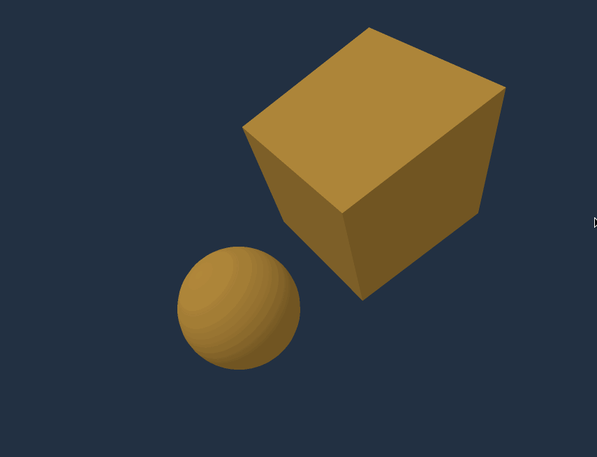
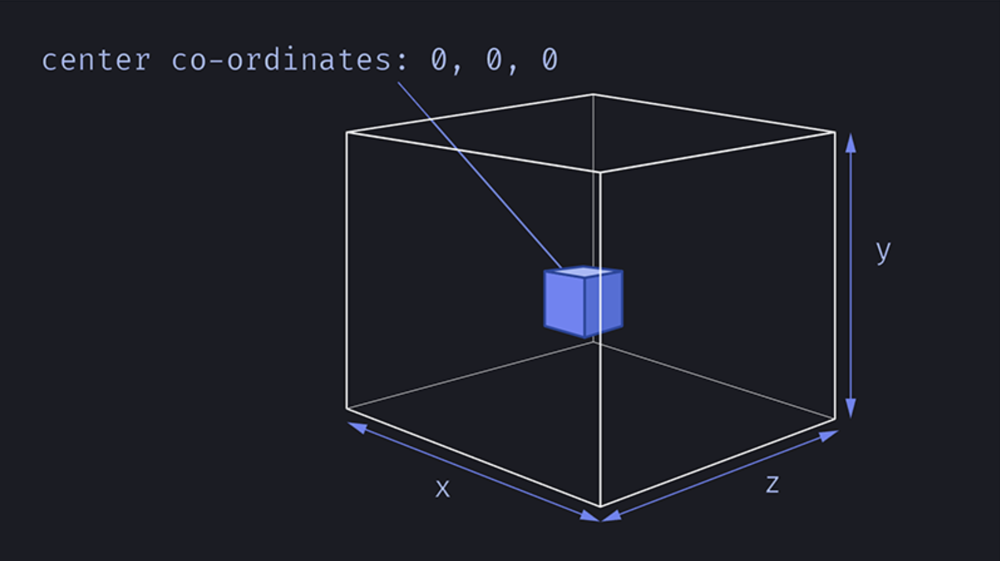
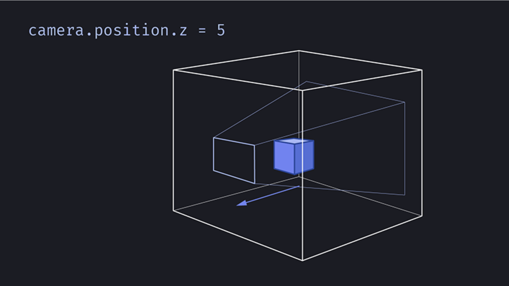
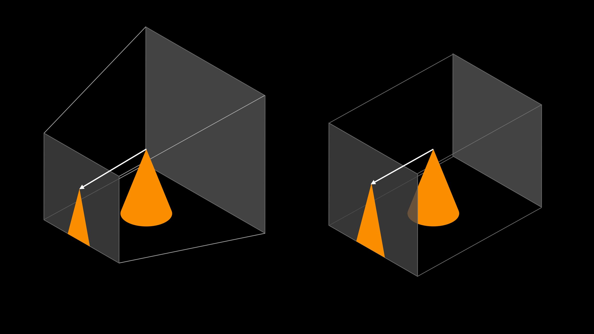
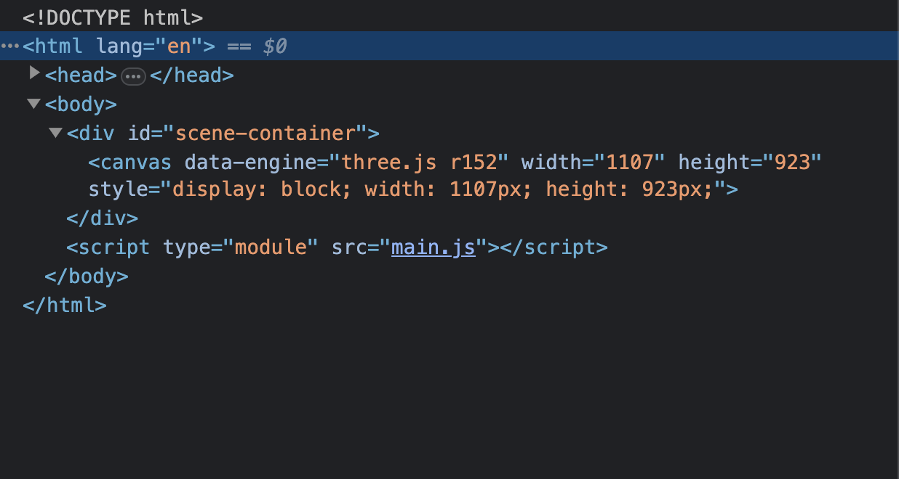
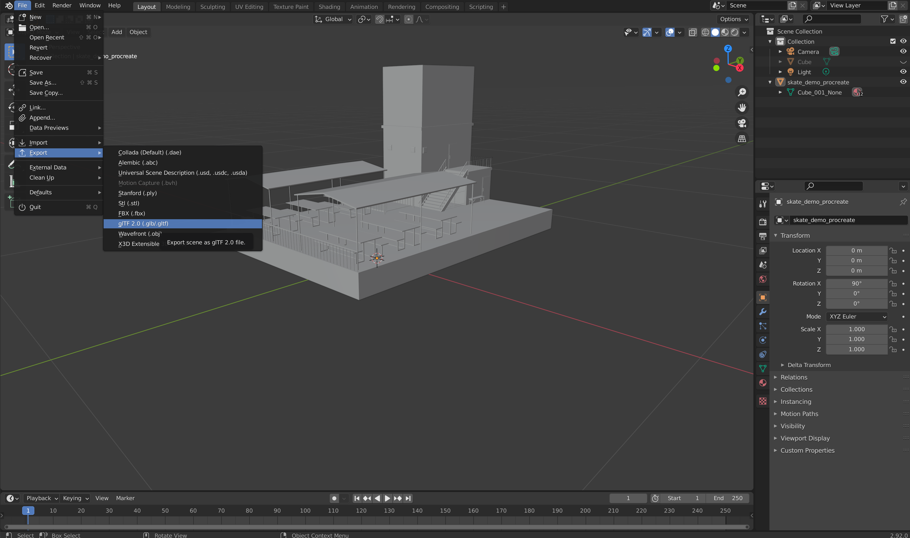
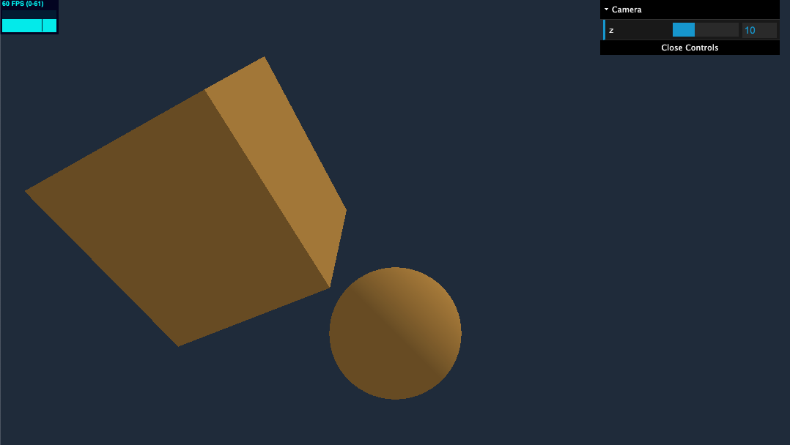
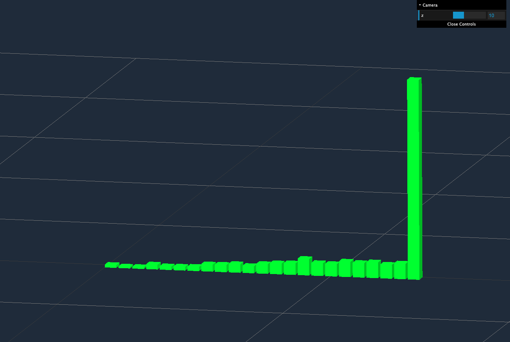

# Interactive 3D graphics

## 🚧 Create a Simple ThreeJS Project 

## What is ThreeJS?

[ThreeJS Documentation](https://threejs.org/docs/index.html#manual/en/introduction/Installation) is a JavaScript library that tries to make it as easy as possible to get 3D content on a webpage. It uses [WebGL]() in an [HTML5 canvas](https://developer.mozilla.org/en-US/docs/Web/API/Canvas_API) to render animations that alone are not possible to create with just WebGL. [WebGL (Web Graphics Library)](https://developer.mozilla.org/en-US/docs/Web/API/WebGL_API) is a JavaScript API for rendering high-performance interactive 3D and 2D graphics to a `<canvas>` element within a compatible web browser without the use of plug-ins.

### What are we building?



## Getting Started

Unzip the project in Google Drive called, [simple-threejs-starter](). The basic structure of every ThreeJS project needs at least one HTML file to define the webpage and a JavaScript file to run the `three.js` code. 

Your project folder should look like the following:
```md
simple-threejs-starter
├── style.css
├── main.js
└── index.html
```
The basic flow of a project is to set up the Three.js environment, giving it a `<canvas>` element to draw to. Then you create a scene, add content (camera, lights, models, textures and shaders), and call render(). The result is output to the provided `<canvas>`.

## Create an HTML Structure

Inside the `index.html` file, place a `<div>` element that has a class called `scene-container`:

```html
<!doctype html>
<html>
<head>
  <meta charset="utf-8">
  <title>Basic ThreeJS Project</title>
</head>
<body>
  <div id="scene-container"></div>
</body>
</html>
```

Then, connect the corresponding `styles.css` and `main.js` files:

```html
<!doctype html>
  <html>
  <head>
    <meta charset="utf-8">
    <title>Basic ThreeJS Project</title>
    <link rel="stylesheet" href="styles.css">
  </head>
  <body>
    <div id="scene-container"></div>

    <script type="module" src="main.js"></script>
  </body>
</html>
```
In the `index.html` file, set your script tag type as "module" and place it just before the closing body tag. 

In the `styles.css` file we will add some basic styling that will remove the default margins and scrollbars, make the scene-container full page and set its background color to the same as the scene’s background color to prevent flashing on load:
```css
 body {
  margin: 0;
  overflow: hidden;
 }

 #scene-container {
  position: absolute;
  width: 100%;
  height: 100%;
  background-color: #233143;
 }
```
In most browsers, the body element has a default margin of 8 pixels which creates a white gap on the perimeter of the screen. So we set the margin to zero to override this style.

## Add ThreeJS Library

To be able to run the Three.js code, you'll need to link the [Three.js library](https://threejs.org/docs/#manual/en/introduction/Installation). For now, we are going to use something called a Content Delivery Network (CDN).

Then, add the following scripts in between the `<head></head>` tags:
* Add an [import map]() defining where to get the package
* Because import maps are not yet supported by some major browsers, we include the polyfill `es-module-shims.js`

```html
  <head>
    <script async src="https://unpkg.com/es-module-shims@1.6.3/dist/es-module-shims.js"></script>
    <script type="importmap">
      {
        "imports": {
          "three": "https://unpkg.com/three@v0.152.0/build/three.module.js",
          "three/addons/": "https://unpkg.com/three@v0.152.0/examples/jsm/"
        }
      }
    </script>
  </head>
  <body>
    ...
    <script type="module" src="./main.js"></script>
  </body>
```

In the `main.js` file, import the three.js core library:

```js
import * as THREE from 'three';
```
Now, we have access to a variable named THREE.

## Local HTTP Server

JavaScript has a security feature called the same-origin policy, which means you cannot load externally hosted files inside of your JavaScript code. Since three.js needs to load geometry, textures, and other files you’ll need a local http server so that your files come from the same origin. Simply opening the index.html file directly in the browser isn’t going to work.

Therefore, let's [run a Local HTTP Server](../01-networks-communciations/README.md) in the same directory as the HTML file:

```bash
$ python3 -m http.server 3000
```

Open the local server's URL in your browser:
```bash
http://localhost:3000/
```
You should see a blank page with a background color, `#233143`. Make changes to your HTML file (like changing the background color) and refresh your browser to see the changes.

Inside of our `main.js` file, we now have access to a variable named THREE. If you console.log() this variable, you'll see that there is a lot going on inside:

```js
console.log(THREE)
```
The THREE variable contains most of the classes and properties you might need on a project. 

## Project Setup

Every Three.js project has three elements that form the basic scaffolding of the application:

1. Scene – where we place all of our rendered objects, lights and cameras
2. Camera – allows us to see objects in the scene
3. Renderer – renders our scene with the WebGL API

The `main.js` file is the entry point for the project. This is where we define the scene, set up the camera and render the scene into the browser.

[scene graph]

## Define the Scene

Think of the scene like a tiny universe where all your 3D objects live. The scene defines a coordinate system called World Space which is a 3D Cartesian coordinate system. 


_Three-dimensional coordiate system_


The very center of the scene is the point (0,0,0), or origin.



To create a scene, use the [Scene]() class:

```js
// create the scene
const scene = new THREE.Scene();
```
Next, query the scene container element in the `index.html` file and set the width and height to that of the scene container. These variables will be used later to set the aspect ratio on the camera.
```js
// get a reference to the container that will hold the scene
const container = document.querySelector('#scene-container');

// global variables
const WIDTH = container.innerWidth
const HEIGHT = container.innerHeight
```
Set the scene's background color to the same color as the `#scene-container` since the default color is black:
```js
scene.background = new THREE.Color('#233143');
```

## Set Up the Camera



_Moving the camera away from the center allows us to see the objects placed in the center of the scene._

Think of the camera as a telescope poining at the tiny universe. Creating a camera defines how we look at the universe. There are two options:
* Perspective camera
* Orthographic camera

The perspective camera is the 3D equivalent of a camera in the real world and uses many of the same concepts and terminology, such as the field of view and the aspect ratio. Video games mostly use perspective cameras, so things that are far away appear smaller. With orthographic cameras objects will have the same size regardless of distance from the camera. For both cameras, we have to define a view frustum.

A frustum is a mathematical term meaning a four-sided rectangular pyramid with the top cut off. In this context, the frustum is the region in the 3D space that is going to be projected to the screen. Things outside the frustum will not appear on screen.



For this project we will be using the [`PerspectiveCamera()`](https://threejs.org/docs/#api/en/cameras/PerspectiveCamera) method which takes four parameters:
1. Field of View (FOV): a number (in degrees) that represents the amount (width) of the observable virtual world that you can see at one point 
2. Aspect Ratio: ratio between the width and height of the scene (width divided by height). Here we are using the `.innerWidth` and `.innerHeight` properties of the window object
3. Near Clipping Pane: the boundary plane closest to the camera, anything closer to the camera will not be rendered
4. Far Clipping Pane: the boundary plane farthest from the camera, anything beyond this pane will not be rendered

At this point, let’s set up some global variables for the camera's four parameters and pass them into the `PerspectiveCamera()` method:

```js
const FOV = 75
const ASPECT = WIDTH / HEIGHT
const NEAR = 0.1
const FAR = 100

// camera
const camera = new THREE.PerspectiveCamera( FOV, ASPECT, NEAR, FAR );
```
The four parameters passed into the `PerspectiveCamera()` define the frustum. 

### Position the Camera
Every object we create is initially positioned at the center of our scene, the point (0,0,0). Which is where our camera is currently located. Let's move it towards us. 

```js
camera.position.set(0, 0, 10)
```

## Set Up the Renderer

Finally, we draw or render the scene into the `<canvas>` element using the `WebGLRenderer`.
```js
// renderer
const renderer = new THREE.WebGLRenderer();
```
In this one line, we tell the renderer to create an image of the scene using the camera and output the image to the canvas element. Then, tell the renderer the size of our scene:

```js
// set the size
renderer.setSize( WIDTH, HEIGHT );
// add automatically created canvas element to the webpage
container.appendChild( renderer.domElement );
```
The renderer will draw our scene from the viewpoint of the camera into a `<canvas>` element. The element has been automatically created for us and is stored in `renderer.domElement`. In order to see it, we need to append it to the `#scene-container` using JavaScripts' `appendChild()` method.

Check the Elements tab in the Developer Console to see the `<canvas>` element nested inside the `#scene-container`.



## Render the scene

Together, the scene, camera, and renderer give us the basic scaffolding of a three.js application.

```js
renderer.render(scene, camera);
```
Now you're ready to fill the scene with objects.

## Define Object

Objects can be many things. You can have primitive geometries, imported models, particles, lights etc. the most common kind of visible object used in 3D computer graphics is the [mesh](). The Mesh takes two parameters:
* Geometry
* Material

The geometry defines the shape of the mesh and the material defines how the surface of the mesh looks.

## Geometry -- Cube

Let's start with a simple `BoxGeometry` and a `MeshBasicMaterial`. To create the geometry, use the BoxGeometry() class and set the width, height, and depth of the box.
```js
// create the geometry
const geometry = new THREE.BoxGeometry( 4, 4, 4 ); 
```
The `MeshBasicMaterial` is the simplest material we can use to describe the appearance of an object. It takes one parameter, an object where we can define its options like texture, color, or opacity.

There are a few ways to specify the color property:
* as a JavaScript hexadecimal 0xff0000
* as a string hexadecimal '#ff0000'
* using color names like 'red'

The following examples uses the JavaScript hexadecimal:
```js
// create the material
const material = new THREE.MeshBasicMaterial({ color: 0xffff00 }); 
```
Finally, create the Mesh and pass in the geometry and material as parameters: 
```js
// create the mesh
const cube = new THREE.Mesh( geometry, material );
```
Position the mesh within the scene and add the mesh to the scene.
```js
// set position
cube.position.set()
// pass mesh to the scene
scene.add(cube)
```
## Geometry -- Sphere

<details>
 <summary>🧩 Challenge: Create a ball mesh using the <b><a href="https://threejs.org/docs/#api/en/geometries/SphereGeometry">SphereGeometry</a></b> and <b><a href="https://threejs.org/docs/#api/en/materials/MeshBasicMaterial">MeshBasicMaterial</a></b> methods then, add it to the scene.</summary>

  <code>
  
  ```js
    const ballGeometry = new THREE.SphereGeometry( 1.5, 32, 32 );
    // create a material
    const ballMaterial = new THREE.MeshBasicMaterial( { color: 0xffff00 } );
    // create mesh with geometry and material
    const ball = new THREE.Mesh( ballGeometry, ballMaterial );
    // set position
    ball.position.set(-4, 3, 0);
    // pass ball mesh to the scene
    scene.add(ball)
  ```
  </code>
</details>

## Animation Loop

If we want to animate the scene, the first thing that we need to do is find some way to re-render the scene at a specific interval. For this behavior we will use [requestAnimationFrame](https://developer.mozilla.org/en-US/docs/Web/API/window/requestAnimationFrame), with it we can specify a function that is called at an interval. This interval is defined by the browser.

Animations, when using Three.js, work like stop motion. You move the objects, and you do a render. Then you move the objects a little more, and you do another render. The more you move the objects between renders, the faster they'll appear to move.

The screen you are looking at runs at a specific frequency. We call that a frame rate. The frame rate mostly depends on the screen, but the computer itself has limitations. Most screens run at 60 frames per second – meaning about a frame every 16ms. 

`requestAnimationFrame` is a built-in browser method that schedules frames in sync with the refresh rate of your monitor and will smoothly reduce the frame rate if your hardware cannot keep up.

To create the animation loop, we create an `animate()` function. Then, we pass the animate function as an argument to request a frame for animation. This will cause the render function to be called at a regular interval. Finally, moving the `renderer.render` inside the animate function will call it over and over to generate a stream of frames.

```js
const animate = () => {
  // call the animate() function every frame - creates a loop
  requestAnimationFrame(animate)
  // render the updated scene and camera
  renderer.render(scene, camera);
}
// don't forget to call the function
animate()
```

## Animate an Object

To rotate the cube we use the `rotation` attribute of an Object3D. It will rotate the object around its axis.

```js
const animate = () => {
  requestAnimationFrame(animate)

  // increase the cube's rotation each frame
  cube.rotation.x += 0.01
  cube.rotation.y += 0.01
  cube.rotation.z += 0

  renderer.render(scene, camera);
}
animate()
```
Here, `cube` is the Mesh. It's attribute `rotation` is responsible for the objects rotation in [radians](https://www.mathsisfun.com/geometry/radians.html). We have incremented the rotation of the x and y axes.

## Challenge: 
* Play with the animation speed.
* Animate some other property of the mesh, e.g. position

## Orbit Controls

One of the most popular extensions is [OrbitControls](https://threejs.org/docs/index.html?q=orbit#examples/en/controls/OrbitControls), a camera controls plugin which allows you to orbit, pan, and zoom the camera using touch, mouse, or keyboard. With these controls, we can view a scene from all angles, zoom in to check tiny details, or zoom out to get a birds-eye overview.

### Importing Orbit Controls

OrbitControls is an add-on, and must be imported explicitly. You can find the orbit controls library in the [UNPKG](https://unpkg.com/browse/three-orbitcontrols@2.110.3/OrbitControls.js) CDN. Add it to the import map:

```html
<script type="importmap">
  {
    "imports": {
    "three": "https://unpkg.com/three@v0.152.0/build/three.module.js",
    "three/addons/": "https://unpkg.com/browse/three-orbitcontrols@2.110.3/OrbitControls.js",
    "three/addons/": "https://unpkg.com/three@v0.152.0/examples/jsm/"
    }
  }
</script>
```
In the `main.js` file, import the orbit controls library:
```js
import { OrbitControls } from 'three/addons/controls/OrbitControls.js';
```
Create a new instance of the orbit controls which takes two parameters: a camera and the canvas, stored in `renderer.domElement`.
```js
// orbit controls allow us to pan with the mouse
const controls = new OrbitControls( camera, renderer.domElement );
```

## Lighting


_By default, the light points down from above_

There are two ways objects in a room can receive light:
* Directly: light rays that come directly from the bulb and hit an object.
* Indirectly: light rays that have bounced off the walls and other objects in the room before hitting an object, changing color, and losing intensity with each bounce.

### Ambient Light

AmbientLight is the cheapest way of faking indirect lighting in three.js. It adds a constant amount of light from every direction to every object in the scene. To set an ambient light we set a color and an intensity.

```js
// Create an ambient light
const ambientLight = new THREE.AmbientLight('white', 0.5)
// add it to the scene
scene.add(ambientLight)
```

### Directional Light

The `DirectionalLight` will have a sun-like effect as if the sun rays were traveling in parallel. To set an directional light we set a color and an intensity.

```js
// Create a directional light
const directionalLight = new THREE.DirectionalLight('white', 8)
// add it to the scene
scene.add(directionalLight)
```
By default, the light will seems to come from above. To change that, you must move the whole light by using the position property like if it were a normal object.

```js
// move the light right, up, and towards us
directionalLight.position.set(10, 10, 10)
```
Now the light is shining from (10,10,10), towards (0,0,0).

## Challenge:
* Try changing the color of the material. All the normal colors like red, green, or blue will work, along with many more exotic colors such as peachpuff, orchid, or papayawhip. Here is a [complete list of color names](https://developer.mozilla.org/en-US/docs/Web/CSS/color_value).
* Try changing the color of the light. Watch how setting various light and material colors give the object its final color.
* Try moving the light around (using `light.position`) and abserve the result.
* A mesh with basic material doesn’t need any light; but the [MeshLambertMaterial](https://threejs.org/docs/#api/en/materials/MeshLambertMaterial) and [MeshPhongMaterial](https://threejs.org/docs/#api/en/materials/MeshPhongMaterial) require light. 
  * Add an ambient light to each of these materials.
  * Add a directional light to each of these materials.
  * Note: See the [full list of available materials](https://threejs.org/docs/index.html?q=material#api/en/constants/Materials) in the ThreeJS docs

***

## 🚧 Load 3D Models

Create a directory called `models`. This is where we will download the 3D models we want to use in the project. The following is a recommended directory structure: 

```md
three-blender-starter
├── models/
   └── Avocado/
    ├── Avocado.bin
    ├── Avocado.gltf
    └── Avocado_normal.png
├── main.js
├── styles.css
└── index.html
```

It is recommended to use glTF (GL Transmission Format) for ThreeJS projects. [glTF](https://www.khronos.org/gltf/) stands for GL Transmission Format and is a specification for the efficient transmission and loading of 3D scenes and models. glTF files can contain models, animations, geometries, materials, lights, cameras, or even entire scenes. This means you can create an entire scene in an external program then load it into three.js.

Find glTF models here:
* [Sketchfab](https://sketchfab.com/3d-models?features=downloadable&sort_by=-likeCount)
* [glTF Sample Models](https://github.com/KhronosGroup/glTF-Sample-Models/tree/master/2.0)
* [ThreeJS WebGL Examples](https://threejs.org/examples/#webgl_loader_gltf) and the [GitHub repository](https://github.com/mrdoob/three.js/tree/master/examples/models/gltf)

Alternatively, you can create models in [Blender](https://www.blender.org/support/tutorials/) and export them to the glTF format. Blender is an open-source 3D graphics application that can be used for modeling, scene building, material creation, animation authoring etc.



### Import GLTFLoader Addon

Find the GLTF Loader addons in the [UNPKG](https://unpkg.com/browse/three-gltf-loader@1.111.0/) CDN. Include it in the import map:

```html
<script type="importmap">
  {
    "imports": {
    "three": "https://unpkg.com/three@v0.152.0/build/three.module.js",
    "three/addons/": "https://unpkg.com/browse/three-gltf-loader@1.111.0/index.js",
    "three/addons/": "https://unpkg.com/three@v0.152.0/examples/jsm/"
    }
  }
</script>
```

In the `main.js` file, import the GLTFLoader addon:
```js
import { GLTFLoader } from 'three/addons/loaders/GLTFLoader.js'
```
Create a new instance of the loader:
```js
// Instantiate a loader
const loader = new GLTFLoader();
```
Then, load the glTF resource and add it to the scene:

```js
// Load a glTF resource
loader.load('./models/Avocado/Avocado.gltf', function(gltf){
  scene.add( gltf.scene );
},
// called while loading is progressing
function(xhr){
  console.log( ( xhr.loaded / xhr.total * 100 ) + '% loaded' );
},
// called when loading has errors
function(error){
  console.log( 'An error happened' );
})
```

Yopu'll notice that the model came in very small. To scale it up (or down), use `scale.set()` on the object:

```js
loader.load('./models/Avocado/Avocado.gltf', function(gltf){
  scene.add( gltf.scene );
  gltf.scene.scale.set(10, 10, 10)
},
```

## Debugging Utilities

An important part of coding is being able to recognize and fix your mistakes – aka debugging. Sometimes these mistakes are typos and other times they are a bit more complex. Fortunately, ThreeJS has available a few customizable debuggin UIs.

### dat.GUI

[dat.GUI](https://github.com/dataarts/dat.gui) is a lightweight graphical user interface for changing variables in JavaScript.[lil-gui](https://lil-gui.georgealways.com/#Guide#Installation) is a more well-documented substitute for dat.GUI. To implement dat.GUI, place the CDN just inside the closing body tag:
```js
  <script src="https://cdnjs.cloudflare.com/ajax/libs/dat-gui/0.7.6/dat.gui.min.js"></script>
  <script src="https://cdnjs.cloudflare.com/ajax/libs/p5.js/0.9.0/p5.min.js"></script>
```
In the `main.js` file, import the datgui module:
```js
import datgui from 'https://cdn.jsdelivr.net/npm/dat.gui@0.7.9/+esm'
```
Just before the `animate` function, declare a new instance of dat.GUI. This will create an empty panel on the top right corner of the screen.
```js
// declare the gui variable
const gui = new datgui.GUI({name: 'Basic Project'});
```
There are different types of elements you can add to that panel:
* color
* text
* folder

Let's add a folder for the camera to experiment with the camera position. Then, add the folder to the panel. The first parameter is the object (in this case the camera) and the second parameter is the property of that object you want to tweak (in this case, the z-index).  The final two numbers are the upper and lower bounds of the camera position's range.
```js
const cameraFolder = gui.addFolder('Camera')
cameraFolder.add(camera.position, 'z', 0, 30)
cameraFolder.open()
```
The dat.GUI GitHub page has an [example UI](https://github.com/dataarts/dat.gui).

### Stats.js

[stats.js](https://github.com/mrdoob/stats.js) provides a simple info box that will help you monitor your code performance. It monitors:
* FPS – Frames rendered in the last second. The higher the number the better.
* MS – MS Milliseconds needed to render a frame. The lower the number the better.
* MB – MBytes of allocated memory.

To implement `stats.js`, place the CDN just inside the closing body tag:
```js
  <script src="https://cdnjs.cloudflare.com/ajax/libs/stats.js/7/Stats.min.js"></script>
  <script src="https://cdnjs.cloudflare.com/ajax/libs/stats.js/7/Stats.js"></script>
```
In the `main.js` file, import the `statsJs` module:
```js
import statsJs from 'https://cdn.jsdelivr.net/npm/stats-js@1.0.1/+esm'
```
Declare a new instance of the statsJs module. This will create an empty panel on the top left corner of the screen. To show the stats panel, use the showPanel() attribute and pass in one  of the options – 0: fps, 1: ms, 2: mb, 3+: custom. 
```js
// declare the stats variable
const stats = new statsJs
// 0: fps, 1: ms, 2: mb, 3+: custom
stats.showPanel(0)
document.body.appendChild( stats.dom );
```
Finally, make sure that we update the stats object whenever the render function is called. 
```js
function animate() {
  requestAnimationFrame(update);
  renderer.render(scene, camera)
  // update the stats object on render
  stats.update()
}
animate();
```


Note: click on the panel to toggle through the monitor options.

## 🚧 Create a three-dimensional bar chart 

### What is SVG?

Scalable Vector Graphics (SVG) is a wb-friendly vector file format. As opposed to pixel-based raster files like JPEGs, vector files store images via mathematical formulas based on points and lines on a grid. This means that vector files like SVG can be significantly resized without losing any of their quality.

There are [several basic shapes](https://developer.mozilla.org/en-US/docs/Web/SVG/Tutorial/Basic_Shapes) used for most SVG drawing:
  * rectangle
  * circle
  * ellipse
  * line
  * polyline
  * polygon
  * [paths](https://developer.mozilla.org/en-US/docs/Web/SVG/Tutorial/Paths), the path is the most powerful element in the SVG library of basic shapes.

Note: SVG has a coordinate system that starts from the top left corner (0, 0). Positive x-axis goes to the right, while the positive y-axis heads to the bottom. Thus, the height of the SVG has to be taken into consideration when it comes to calculating the y coordinate of an element.


### What is D3?

Data-Driven-Documents [(D3.js)](https://d3js.org/) is an open-source JavaScript library for creating visualizations like charts, maps, and more on the web. It can help you bring data to life using SVG, Canvas and HTML

### What are we building?



Bar charts are a useful and effective way to compare data between different groups. 

x -- year
y -- attnedance
z -- hosts (countries)

### Directory and File Setup

```md
threejs-with-d3-starter
├── main.js
├── styles.css
└── index.html
```
### Add the D3 CDN

In the `index.html` file, add the [D3](https://d3js.org/getting-started) library to the webpage using the CDN. The `<script>` elements will go in between the `<head>` tags, after the three.js and above the stylesheet. __Remember, you are building on top of an existing boilerplate threejs project.__

```html
<!DOCTYPE html>
<html lang="en">
  <head>
    <meta charset="UTF-8">
    <meta name="viewport" content="width=device-width, initial-scale=1.0">
    <title>ThreeJS D3 Project</title>
    <script async src="https://unpkg.com/es-module-shims@1.6.3/dist/es-module-shims.js"></script>
    <script type="importmap">
        {
          "imports": {
            "three": "https://unpkg.com/three@v0.154.0/build/three.module.js",
            "three/addons/": "https://unpkg.com/browse/three-orbitcontrols@2.110.3/OrbitControls.js",
            "three/addons/": "https://unpkg.com/three@v0.154.0/examples/jsm/"
          }
        }
    </script>
    <!-- add the D3 script here -->
    <script src="https://cdnjs.cloudflare.com/ajax/libs/d3/7.8.5/d3.min.js"></script>
    <script src="https://cdnjs.cloudflare.com/ajax/libs/d3/7.8.5/d3.js"></script>

    <link rel="stylesheet" href="styles.css">
  </head>
  <body>
    <div id="scene-container"></div>
    <script type="module" src="script.js"></script>
  </body>
</html>
```

In the `main.js` file, import the [D3 library](https://d3js.org/getting-started):
```js
//==== libraries and addons
import * as d3 from "https://cdn.jsdelivr.net/npm/d3@7/+esm";
```
### Define the Chart Area 

Recall, we already have a `<div id="scene-container"></div>` element in the `index.html` file with an id name, `#scene-container`. We want to attach a new `svg` element to this `div` and provide it with a few attributes.

JavaScript uses methods like [querySelector()](https://developer.mozilla.org/en-US/docs/Web/API/Document/querySelector) to select and modify the Document Object Model (DOM) and create dynamic HTML. Similarly, D3 provides its own methods to manipulate the DOM:

#### How to Select Elements in D3

* `d3.select()` will take any CSS selector and return the first matching element. If there are multiple elements, use `d3.selectAll()`

#### How to Modify Elements in D3

* `d3.append()` appends a new element as a child of the selected element
* `d3.attr()` updates the selected elements' attributes

The following DOM manipulation methods take in a constant value as a parameter. Later on, we will write methods that take in a function as a parameter. 

```js
// set the chart margins, padding and dimensions for future use
const chart_width = window.innerWidth;
const chart_height = window.innerHeight - 60;
const padding = 10;
const margin = { top: 30, right: 0, bottom: 60, left: 30 };

// append the svg to the threejs canvas
let svg = d3
  // a <canvas> element was automatically created and appended to the webpage, so we can select it
  .select("canvas")
  // append the svg element to the canvas
  .append("svg")
    // set the width and height attributes to the svg element
    .attr("width", chart_width + margin.left + margin.right)
    .attr("height", chart_height + margin.top * margin.bottom)
    // you can giv the svg element its own class name
    .attr("class", "bar-chart");
```
You should now see the SVG element in the dev tools window:

!()[]

With the `.bar-chart` class you can customize its color in the `styles.css` file.

### Loading Data in D3

D3 can handle multiple types of local or external data. For this module we will focus on the following methods of loading data:

* d3.csv()
* d3.json()

```js
  d3.csv("assets/fifa_world_cup_attendance/FIFA-World-Cup-Attendance.csv", d3.autoType)
  .then(data => {
    console.log(data)
  })
```
Here, `d3.csv()` takes the [d3.autoType](https://observablehq.com/@d3/d3-autotype) function as an argument and detects common data types such as numbers, dates and booleans on each row of the csv as it is being read in, and convert values to the corresponding JavaScript type

Why is this useful? If you don’t perform any type conversion, you’ll get strings and you cannot perform mathematical operations on strings.

### What Does the Data Look Like?

Our data is an array or objects which we will need to iterate over at some point to access the `Year`, `Hosts` and `Total_Attendance` properties for each row. 
```js
  /*
    Shape of the data object:
    {
      Game(s): "Uruguay 6–1 Yugoslavia, Semi-final"
      Hosts: "Uruguay"
      Matches: 18
      Total_Attendance: 590549
      Venue: "Estadio Centenario, Montevideo"
      Year: 1930
    }
  */
```
### Scales and Axes

First let’s be clear about what it is we are visualizing: 
  * along the x-axis is the `Year` which will be in `DateTime` format, 
  * along the y-axis is the `Total_Attendance` which is a `Number` format, and 
  * along the z-axis is the `Hosts` (Country) which is a `String` format. 

#### Scales

Think about architectural drawings, where 1 cm figures a real distance of 1 meter on the terrain, we say that the map has a 1:100 scale. 


We're essentially transforming abstract data into visual representations. For example, test scores and city populations become column heights measured in pixels. These are done with scales and D3 has different scales for different purposes. We will be focusing on the following scaling functions:

* scaleLinear() is probably the most commonly used scale type as they are the most suitable scale for transforming data values into positions and lengths. They are useful when creating bar charts, line charts and many other chart types. We will use this to visualize the `Total_Attendance` along the y-axis:
    
    * ```const y_scale = scaleLinear()```

* scaleTime() is similar to scaleLinear except the domain is expressed as an array of dates. We will use this to visualize the `Year` along the x-axis:
    
    * ```const x_scale = scaleTime()```

* scaleBand() helps to determine the geometry of the bars, taking into account padding between each bar. We will use this to visualize the `Hosts` data along z-axis:
    
    * ```const z_scale = scaleBand()```

#### Range

Every scale in D3 has two parts: a domain and a range.
* A scale's domain describes the set of possible input values to the scale. 
* A scale's range, on the other hand, describes the set of possible output values that the input values can be converted to.

Since we're building a bar chart to display `Total_Attendance`, we'd want our `range` to describe the minimum and maximum bar sizes.
```js
// Declare the y (vertical position) scale, Total_Attendance
const y_scale = scaleLinear()
  // limit the height of the bars to the height of the chart
  .range([chart_height, 0]) // this is flipped
```
Let's repeat for the `Year` where we want our `range` to describe the minimum and maximum year values:
```js
// Declare the x (horizontal position) scale, Year
const x_scale = scaleTime()
  .range([0, chart_width])
```
Finally, for the `Hosts` where we want our `range` to describe the minimum and maximum number of items in the dataset:
```js
   // Declare the z (horizontal position) scale, Hosts
  const z_scale = d3.scaleBand()
  .range([0, data.length])
```
#### Defining the Coordinate System 

SVG has a coordinate system that starts from the top left corner (0, 0). Positive x-axis goes to the right, while the positive y-axis heads to the bottom. However, in algebra charts have an origin that starts from the bottom left.


Defining the coordinate system means setting the origin point. To define the coordinate system, we use the `.range()` method. This method tells D3 that the larger values (height) are at top of the screen and the low values are at the bottom.


The format for the range is:
```js
.range([close_to_the_origin, far_from_the_origin])
```
So when we put the `chart_height` variable first, it's now associated with the top of the screen.


#### Domain

In the `y_scale` domain function we're using a helper called [d3.max()](https://observablehq.com/@d3/d3-extent). Similar to `Math.max()`, it looks at our data set and figures out what is the largest value. While `Math.max()` only works on two numbers, `d3.max()` will iterate over an entire Array.
```js
// Declare the y (vertical position) scale, Total_Attendance
const y_scale = scaleLinear()
  .range([chart_height, 0])
  .domain([0, d3.max(data, d => d["Total_Attendance"])])
```
In the `x_scale` domain function, we are using a helper called [d3.extent()]() and a helper function called `timeParse()`:
```js
    // min and max variables
    let xMin = d3.min(data, (d) => d['Year'])
    let xMax = d3.max(data, (d) => d['Year'])
    // 
    const x_scale = d3.scaleTime()
      .domain([new Date(xMin), new Date(xMax)])
      .range([0, chart_width])
```
`d3.extent()` is like a shortcut for `[d3.min(array), d3.max(array)]`, returning a two element array of the minimum and maximum values from the array. It's perfect for passing to a scale's `domain` method. 

The `z_scale` domain function is a band scale so we set the domain to the name of the host countries. Using the JavaScript [map()](https://developer.mozilla.org/en-US/docs/Web/JavaScript/Reference/Global_Objects/Array/map) method we can create a new array populated with the results of each element.
```js
  const zScale = d3.scaleBand()
      .domain(data.map(d => d["Hosts"])) // array of host country names
      .range([0, data.length])
```

### Build the Bars

First, we tell the browser to find the svg element and look inside it for any rectangles. If it finds rectangles, it returns them in a selection that is an array of elements. If it doesn’t find any, it returns an empty selection.
```js
svg.selectAll('rect')
  .data(data)
  .enter() // take data items one by one and perform further operations on each element
```
Next, we bind the data to the selection by counting and parsing each value. Since there are 23 elements in our dataset, every operation will be done 23 times going forward. In this case, we are adding twenty-three rectangles to the svg.
```js
svg.selectAll('rect')
  .data(data)
  .enter()
    .append("rect")
    .attr("class", "bar")
```
Here, the y-attribute refers to where the bars end, so its simply the scaled value of the data. To get the height attribute, we scale the data value (total attendance) and subtract it from the height of the container:
```js
.attr("y", (d) => y(d['Total_Attendance']))
.attr("height", d => height - y(d["Total_Attendance"]))
```
Here, the x-attribute refers to the starting position of the bars and the width attribute is the calculated barWidth minus the padding between the bars.
```js
.attr("x", d => x_scale(formatYear(d["Year"])))
.attr("width", barWidth - padding)
```
Finally, we want to get all the bars in place across the x-axis. To do this, we use the CSS transform [translate()](https://developer.mozilla.org/en-US/docs/Web/CSS/transform-function/translate) function which will reposition each bar in the horizontal or vertical direction.
```js
.attr("transform", ((d, i) => {
    let translate = barWidth * i
    console.log(translate)
    return `translate(${translate}, 0)`
}))
```

### Load SVG
 
The SVGLoader loads SVG from an URL and parses it into three.js entries. Add the `SVGLoader` library to the list of addons in the importmap:
```js
  <script type="importmap">
    {
      "imports": {
        "three": "https://unpkg.com/three@v0.154.0/build/three.module.js",
        "three/addons/": "https://unpkg.com/browse/svg-loader@0.0.2/index.js",
      }
    }
  </script>
```
Then, import the module in `main.js`:
```js
import { SVGLoader } from 'three/addons/loaders/SVGLoader.js';
```
Next, make a reference to all the `<rect>` elements and instantiate the loader:
```js
  // make a reference to all the svgs
  const svgList = document.querySelectorAll("rect");
  
  // instantiate a loader
  const loader = new SVGLoader();
```
Iterate over each svg element and grab the svg markup as a string:
```js
    for (let i = 0; i < svgList.length; i++) {
      const svgMarkup = svgList[i].outerHTML
    }
```
You should see the following in the developer console:
```html
<rect height="7.2539308227990205" width="51" transform="translate(61, 0)"></rect>
```
Load the SVG resource into the parse method and it is ready to be extruded:
```js
// load a SVG resource
const svgData = loader.parse(svgMarkup);
```
Call the `paths` method on the data which will return an array of `ShapePaths`. Each of these has a property `toShapes(true)` method.
```js
const shape = svgData.paths[0].toShapes(true)[0];
```
Create the bars using [ExtrudeGeometry](https://threejs.org/docs/#api/en/geometries/ExtrudeGeometry). ExtrudeGeometry takes two attributes:
* shapes, Shape or an array of shapes.
* options, Object that can contain the following parameters (steps, depth, etc)
We'll just use two of the default options for now:
* steps, Number of points used for subdividing segments along the depth of the extruded spline
* depth, Depth to extrude the shape. 
```js
  const extrudeOptions = {
    steps: 2,
    depth: barWidth, // set depth to bar width
  }
  const geometry = new THREE.ExtrudeGeometry(shape, extrudeOptions);
```
The second requirement for a mesh is the material.
```js
const material = new THREE.MeshNormalMaterial({ 
  color: 'green'
});
```
Finally, create the Mesh and add it to the scene:
```js
const mesh = new THREE.Mesh( geometry, material ) ;
scene.add( mesh );
``` 
Set the position of the mesh to the scene origin:
```js
mesh.position.set(0, 0 , 0);
```