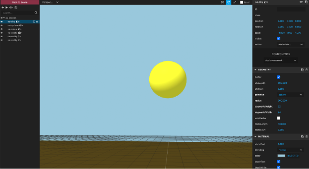
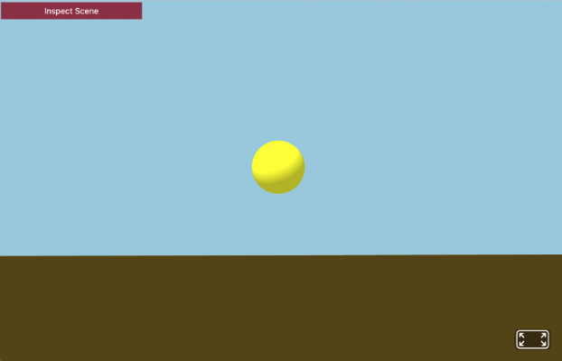
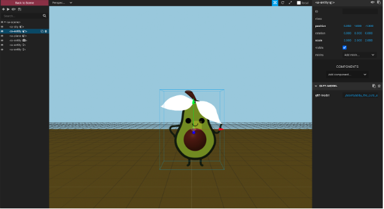

# Virtual and Augmented Reality

## WebVR

Learning Objective: 

#### What are we building?

<screenshot>

#### Directory and File Setup

```md​​
hello-cube-vr-app
├── assets/
   ├── components/
   └── models/
├── styles.css
├── main.js
└── index.html
```

### What is A-Frame?

WebVR is a JavaScript API that allows VR experiences to run in a web browser on VR headsets, mobile phones and tablets, and regular computers. 

Technically, [A-Frame](https://aframe.io/docs/1.4.0/introduction/) is an abstraction of three.js, a JavaScript library that uses the WebGL API to render 3D graphics in the browser.

It is a web framework for building virtual reality (VR) experiences for the web. At its simplest, it is an HTML web page that includes the A-Frame library, making it simple to get started.

### Getting Started

Spin up a local server in the `hello-cube-vr-starter`

### Create an HTML Structure

In the `index.html` file, start by creating a simple HTML document with basic head and body tags. Then, include the A-Frame CDN `<script>` in the `<head>` tag.
```html
<!doctype html>
<html>
  <head>
    <meta charset="utf-8">
    <title>Simple A-Frame Project</title>
    <!-- A-Frame CDN -->
    <script src="https://cdnjs.cloudflare.com/ajax/libs/aframe/1.4.2/aframe.min.js"></script>
  </head>
  <body>
    <!-- HTML goes here -->
  </body>
</html>
```
### Define the Scene

In A-Frame, scenes are enclosed in `<a-scene></a-scene>` tags. It's what creates the stage for you to place 3D objects in, initializes the camera, the WebGL renderer and handles other boilerplate. It should be the outermost element wrapping everything else inside it.

Let's create an empty scene by adding an `<a-scene>` element inside the `<body>` element:

```html
<body>
    <a-scene></a-scene>
</body>
```
### Add background

#### Using Color

A sky box is a background in the 3D world. Every scene needs a background which can be a color or 360° image. In A-Frame, it’s represented by the <a-sky> primitive. Looking around in your scene would give the impression of being inside an open sky, a loft apartment or rolling fields of grass.

A background with a simple color looks like the following:
```html
<body>
    <a-scene>
	   <a-sky color="#A6CFE2"></a-sky>
    </a-scene>
</body>
```
Save the code and refresh your browser. You should immediately see a blue background.

The floor is represented by the <a-plane> primitive. You can give it a few attributes like color, width, and rotation. In order to make the plane parallel to the ground or make a plane the ground itself, it must be rotated around the X-axis.
```html
<a-plane
  rotation="-90 0 0"
  color="#52430e"
  height="20"
  width="100">
</a-plane>
```
#### Using 360° Images

Background images should be equirectangular and can be found in abundance on [Flickr](https://www.flickr.com/groups/equirectangular/):
```html
<a-assets>
  
</a-assets>
<a-sky src="#city"></a-sky>
```
Note: A-Frame’s [asset management system](https://aframe.io/docs/0.9.0/core/asset-management-system.html), `<a-assets>` used to preload images, videos, sound and 3D models.

A-Frame takes care of setting up everything you need:
* A default light source and camera are included, so the cube is visible.
* The controls on your mouse and keyboard are already working: for the keyboard try the W, A, S and D keys
* There is also and “Enter VR Mode” button in the bottom right corner of the screen

### Launch the A-Frame Inspector

Access the A-Frame inspector by: 
* `<ctrl>` + `<alt>` + i (Windows)
* `<ctrl>` + `<option>` + i (Mac)



### Populate the Environment

There are two ways that we can populate the scene we’ve just created:
1. use primitive shapes; and 
2. import 3D models.

#### Geometries

Let’s jump to the AFRAME documentation for the sphere primitive. The following sphere has two attributes, color and radius; however, we can also add attributes like scale and position.

```html
<a-sphere 
    color="yellow" 
    radius="5" 
    position="0 4 -10" 
    scale="0.25 0.25 0.25"></a-sphere>
```



We can also use an entity (I liken it to a div in HTML) and add attributes like geometry, material, and animation.
```html
<a-entity
  id='ball'
  position="0.05 1 -5"
  geometry="primitive:sphere; radius: 0.05;">
</a-entity>
```
#### Material

Define the material on the sphere by adding a material attribute to the `a-entity`. In the attribute we can set up the color and its roughness (a rougher material will scatter reflected light in more directions than a smooth material):
```html
<a-entity
  id='ball'
  position="0.05 1 -5"
  material="roughness:0.5; metalness:0.5"
  geometry="primitive:sphere; radius: 0.05;">
</a-entity>
```

#### 3D Models

For characters in the game, we are going to use a 3D model created in [SketchFab](https://sketchfab.com/search?q=pacman&sort_by=-pertinence&type=models). A-Frame uses the [glTF format](https://aframe.io/docs/0.9.0/components/gltf-model.html). We can load a glTF model by pointing to an asset that specifies the src for the file:

```html
<a-scene>
  <a-assets>
    <a-asset-item id="model-name" src="/path/to/model-name.gltf"></a-asset-item>
  </a-assets>

  <a-entity gltf-model="#model-name"></a-entity>
</a-scene>
```
First, download the model. Places to find 3D models include:
* [Sketchfab](https://sketchfab.com/3d-models?features=downloadable&sort_by=-likeCount)
* [Sketchup 3D Warehouse](https://3dwarehouse.sketchup.com/)

Then, create a `assets/models` folder and add the downloaded models into the folder. Preload the models using `<a-asset-item>` tag and then add it to the assets section of your code base:
```html
<a-scene>
  <a-assets>
    <a-asset-item id="model-name" src="./assets/models/Model-Name.gltf"></a-asset-item>
  </a-assets>

  <a-entity gltf-model="#model-name"></a-entity>
</a-scene>
```
Outside the `<a-assets>` section, create several entities to load the  model:
```html
<a-entity 
  class="item" 
  cursor-listener 
  gltf-model="#model-name" 
  position="0.05 1 -1" 
  scale="2 2 2">
</a-entity>
```
The additional attributes available on our entity -- `position`, which sets x, y, and z coordinates on each entity; `scale`, which defines a shrinking, stretching, or skewing transformation of an entity; and the `gltf-model`, which loads the model into the frame -- allow us to customize the placement etc of each entity.



If you’d prefer to create your own 3D models, here are some places to start:
* Rhino/Grasshopper
* Blender
* Autodesk Maya
* Maxon Cinema4D 

### Specify a Camera

A camera is situated by default at the average height of human eye level (1.6 meters). Add a camera to the scene with default origin at 0 1.6 0 in desktop mode and 0 0 0 in VR mode. This roughly corresponds to the average eye height of most humans.
```html
<a-camera position="0 1.6 0">
  <a-cursor></a-cursor>
</a-camera>
```
Note: the `<a-cursor>` inside of the camera. This will draw a little circular cursor, which is important for displays that don’t have controllers, such as Google Cardboard.

The cursor primitive is a reticle that allows for clicking and basic interactivity with a scene on devices that do not have a hand controller. 

### Add Lights

The basic light types in A-Frame are directional and ambient. Add one of each to see the impact it makes on the sphere and the ground plane.
```html
<a-light type="directional" color="#FFF" intensity="0.5" position="-1 1 2"></a-light>

<a-light type="ambient" color="#FFF"></a-light>
```
The directional light has a white (`#FFF`) color, its intensity is set to `0.5`, and it is placed at position `-1 1 2`. The ambient light only needs a color, which is also white.

### Add Interactivity

#### Dynamically Add Entities to the Scene

Let’s start with something trivial like a sphere or cube. Add a `<script>` tag just before the closing body tag:

```html
<body>
    <a-scene>

    </a-scene>
    <script src="main.js"></script>
</body>
```
In the `main.js` file, query the scene entity from the `index.html` file. Create a new entity called, cube.
```js
// query the scene
const scene = document.querySelector("a-scene");
// create a new entity
const cube = document.createElement("a-box");
```
Then, set the attributes for the cube: color, height, depth, width and position. Finally, append the cube to the scene.
```js
// set the cube attributes
cube.setAttribute('color', 'tomato')
cube.setAttribute('height', '2')
cube.setAttribute('depth', '2')
cube.setAttribute('width', '2')
cube.setAttribute("position", "3 1 0");
// append the cube to the scene
scene.appendChild(cube);
```
You should now see a reddish colored box in the scene.

#### Animation

We can animate an entity by placing the [animation](https://aframe.io/docs/1.4.0/components/animation.html) attribute on the entity you want to animate and passing it several properties – duration, easing, and position.

#### Translation
In this animation, we want the box to move towards us from the back of the scene along the z axis, so we define the `position` and `to` attributes:

```html
<a-box 
  color="blue"
  position="0.05 1 -5"
  animation="property: position; to: 0.25 1.5 0.5; dur: 5000; easing: linear"
  ></a-box>
```

* Duration -- indicates how long (in milliseconds) each cycle of the animation is.
* Easing -- defines how you want the entity to move/or what pattern do you want your animation to follow. In this case the easing is “linear”, which makes the animation constant in its movement.
* Loop -- defines how many times the animation should repeat. If the value is true, the animation will repeat infinitely.

Let's make the reddish box move using JavaScript. Define a `moveRight()` function that updates the cube's position on every frame. 

```js
let count = 0;
const moveRight = () => {
  count += 0.01
  requestAnimationFrame(render);
  cube.setAttribute('position', `${Math.sin(count * 2) + 1} 3 0`)
} 
moveRight()
```


#### Rotation
In this animation, we want the model to rotate at 360° in the y axis, so we define the `to` attribute to that value. We animate the rotation attribute from 20 0 0 to 20 360 0, so it will do a full spin. 

```html
  <a-entity 
    gltf-model="#abby-avocado" 
    position="20 0 0" 
    scale="2 2 2" 
    animation="property: rotation; to: 20 360 0; loop: true; dur: 10000"></a-entity>
```

* Loop -- indicates how many times the animation should repeat. If the value is true, the animation will repeat infinitely.
* Property -- identifies the property to animate. It can be a component name, or a plain attribute.

#### Scaling

The initial, default scale is `1 1 1,` and we're going to animate it to `1 0.5 1`, so the y axis will be scaled from 1 to 0.5. The easing we're going to use is linear. 

```html
<a-box 
  color="#0AB300"
  position="0.05 1 -5"
  animation="property: scale; to: 1 0.5 1; dur: 5000; easing: linear"
  ></a-box>
```

### Add Audio

To add sound to the scene, a good resource is [freesound.org](https://freesound.org/browse/) or a CDN. When adding sound, like images you must preload and cache the audio tag within the asset management system:
```html
<audio id="crickets" src="https://cdn.aframe.io/basic-guide/audio/backgroundnoise.wav" autoplay preload></audio>
```
Then, add the sound component to one of the entities in the scene:
```html
<a-entity sound="src: #crickets"></a-entity>
```

***

## WebAR

There are three types of tracking in augmented reality that allow us to place digital content in different environments. 
1. Image Tracking
2. Location Based
3. Marker Tracking

Let's set up the environment for a standard augmented reality application and then look at each type of tracking separately.

### Create an HTML Structure

In the index.html, add the A-Frame and ar.js scripts just before the closing head tag. These scripts contain the code that will allow you to add the augmented reality functionality to this tab.
```html
<!DOCTYPE html>
<html lang="en">
<head>
  <title>Hello Cube Augmented Reality</title>
  <script src="https://aframe.io/releases/1.0.4/aframe.min.js"></script>
</head>
<body>

  <script src="main.js"></script>
</body>
</html>
```

### Define the Scene

In ARjs, scenes are enclosed in <a-scene></a-scene> tags. It should be the outermost element wrapping everything else inside it.

Let's create an empty scene by adding an <a-scene> element inside the <body> element:
```html
<body>
    <a-scene embedded arjs>
	
    </a-scene>
</body>
```
The `arjs` attribute specifies that the scene should use the `AR.js` library to display the augmented reality content.

### Image Based Tracking

Image Tracking makes it possible to scan a picture, a drawing, any image, and show content over it. The software tracks interesting points in the image and using them, it estimates the position of the camera.  These interesting points (aka "Image Descriptors") are created using the NFT Marker Creator, a tool available for creating NFT markers.

Resource: [Creating Good Image Markers](https://github.com/Carnaux/NFT-Marker-Creator/wiki/Creating-good-markers)

#### Import the Library

```js
// import the ar.js with image tracking just below the aframe library
<script src="https://aframe.io/releases/1.0.4/aframe.min.js"></script>
<script src="https://raw.githack.com/AR-js-org/AR.js/master/aframe/build/aframe-ar-nft.js"></script>
```

#### Add the Loader

You can add any custom loader that will be removed when image descriptors are loaded, just use the `.arjs-loader` CSS class on it.

```js
  // minimal loader shown until image descriptors are loaded ... loading may take a while according to the device computational power
  <div class="arjs-loader">
    <div>Loading, please wait...</div>
  </div>
```
Use the following styles on the loader:

```css
.arjs-loader {
    height: 100%;
    width: 100%;
    position: absolute;
    top: 0;
    left: 0;
    background-color: rgba(0, 0, 0, 0.8);
    z-index: 9999;
    display: flex;
    justify-content: center;
    align-items: center;
}

.arjs-loader div {
    text-align: center;
    font-size: 1.25em;
    color: white;
}
```
#### Creating Image Descriptors

Image descriptors are a set of files that describe your image and are needed by the tracking algorithm. We will use the web-based version of the [NFT Marker Creator](https://carnaux.github.io/NFT-Marker-Creator/#/). Upload your image and click `generate` to create the descriptors. Once the image is processed __three files__ will automatically download with `.fset`, `.fset3`, and `.iset` extensions. 


#### Spin Up the Local HTTP Server

```bash
python3 -m http.server 3000
```

#### Scene Attributes

```html
<body>
    <a-scene 
      vr-mode-ui="enabled: false"
      renderer="logarithmicDepthBuffer: true; precision: medium;"
      embedded 
      arjs="trackingMethod: best; sourceType: webcam; debugUIEnabled: false;">
    </a-scene>
</body>
```

* The [vr-mode-ui](https://aframe.io/docs/1.4.0/components/vr-mode-ui.html) component allows disabling of UI such as an Enter VR button, compatibility modal, and orientation modal for mobile.
* [embedded](https://aframe.io/docs/1.4.0/components/embedded.html) component removes fullscreen CSS styles from A-Frame’s `<canvas>` element, making it easier to embed within the layout of an existing webpage. Embedding removes the default fixed positioning from the canvas and makes the Enter VR button smaller.
* The [renderer](https://aframe.io/docs/1.4.0/components/renderer.html) system configures a scene’s `THREE.WebGLRenderer` instance. 
  * [logarithmicDepthBuffer](https://aframe.io/docs/1.4.0/components/renderer.html#logarithmicdepthbuffer) provides better sorting and rendering in scenes containing very large differences of scale and distance
  * [precision](https://aframe.io/docs/1.4.0/components/renderer.html#precision) attribute sets precision in fragment shaders. Main use is to address issues in older hardware / drivers. Set to `medium` as a workaround. It will improve performance, in mobile in particular but be aware that might cause visual artifacts in shaders / textures.

#### Load the NFT Marker

Point the url to the path containing the Image Descriptors you generated and downloaded before: `../assets/dino-image/dino-image-tracking`. Those files will have a common name. 

```js
<a-nft
  type="nft"
  url="./assets/dino-image/dino-image-tracking"
  smooth="true"
  smoothCount="10"
  smoothTolerance=".01"
  smoothThreshold="5"
></a-nft>
```
It is suggested to use `smooth`, `smoothCount` and `smoothTolerance` because of weak stabilization of content in Image Tracking. 

#### Load the 3D Model

Define the content to display the augmented reality content when you hover over the tracking image.

```js
  <a-entity
    gltf-model="./assets/animated-cube/AnimatedCube.gltf"
    scale="5 5 5"
    position="50 150 0"
  >
  </a-entity>
```

You can replace the model above with any other assets: 2D videos, images, audio files. Any A-Frame `a-entity` is a valid child of the `a-nft` anchor.

#### Camera

The [camera](https://aframe.io/docs/1.4.0/components/camera.html) component defines from which perspective the user views the scene.

```js
<a-entity camera></a-entity>
```

Now the user can visit the website. It will create the AR experience and present the user with the asset loading screen. Once it is completed, point to the image, and you will be presented with the AR content specified in the code block.


### Location Based Tracking

It can be used for indoor (but with low precision) and outdoor geopositioning of AR content. You as a developer can specify places fo interest represented by real-world coordinates on which the AR content will appear.

List of NFT Generators:
* [NFT Marker Creator](https://carnaux.github.io/NFT-Marker-Creator/#/), Web version
* [NFT Marker Creator](https://github.com/Carnaux/NFT-Marker-Creator), NodeJS version

### Marker Based Tracking

Markers are a sort of simplified qr-codes. AR.js defines specific 3D scenes for specific markers, so when the camera recognizes a marker, the web-app shows the 3D model on top of it. Marker based tracking requires barcodes, patterns or actual QR codes to activate the experience.

List of Marker Generators:
* [Custom Marker Generator](https://jeromeetienne.github.io/AR.js/three.js/examples/marker-training/examples/generator.html)
* [AR Marker Generator](https://au.gmented.com/app/marker/marker.php)
* [Pattern Markers](https://github.com/artoolkit/artoolkit5/tree/master/doc/patterns)
* [QR Code Generator](https://www.qrcode-monkey.com/)

Resource: [Ten Tips to Enhance Your ARjs application](https://medium.com/chialab-open-source/10-tips-to-enhance-your-ar-js-app-8b44c6faffca), Nicolò Carpignoli, Medium

### The End.