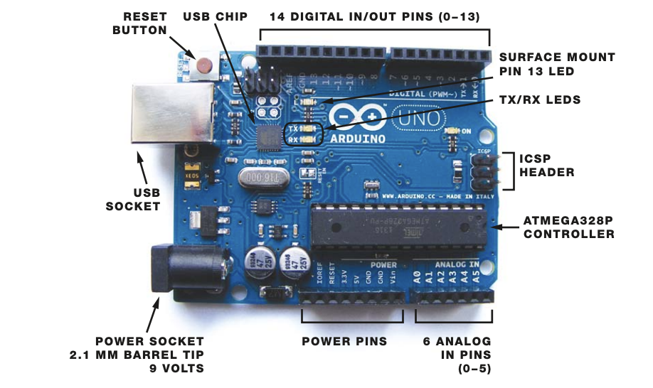
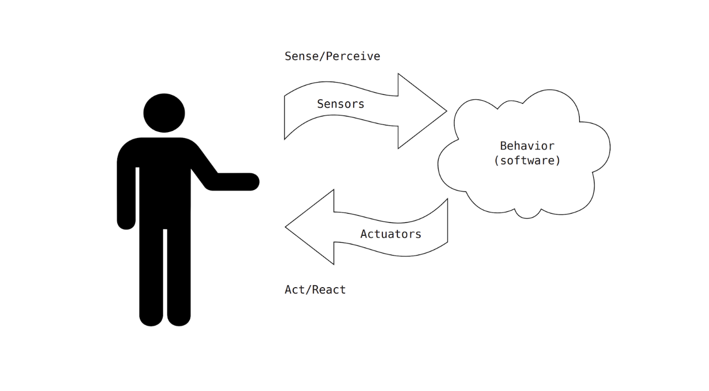
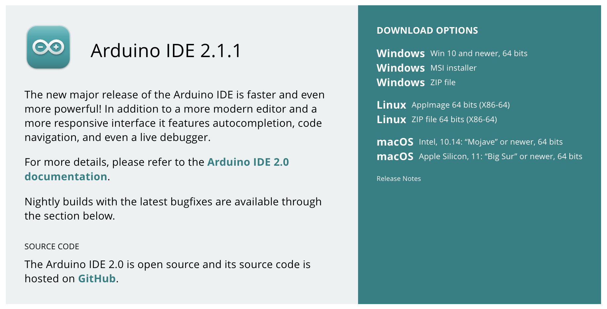
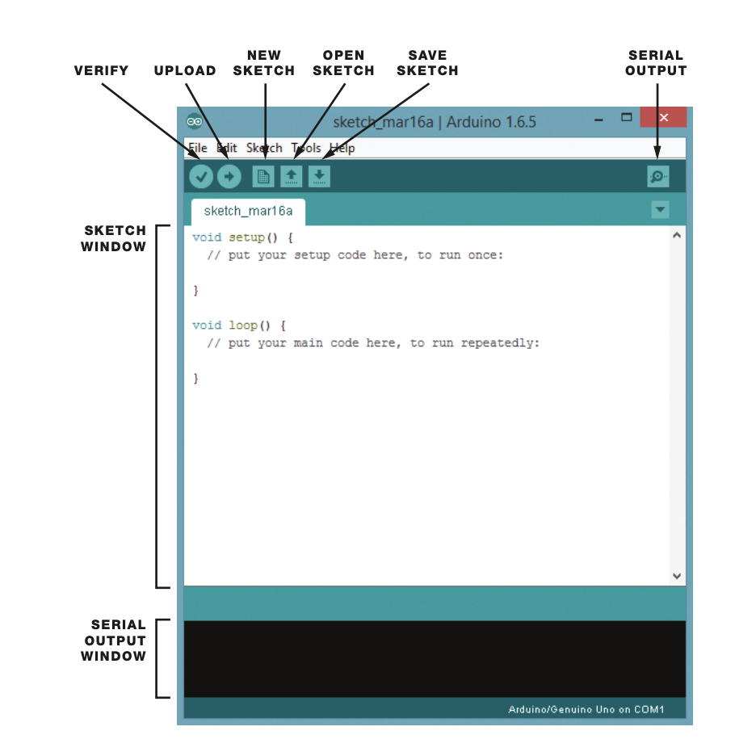

# Arduino

## History of Arduino

Arduino is made up of two parts: (1) the Arduino board, a piece of hardware and (2) the IDE, a piece of software run on your computer. You use the IDE to create a sketch (a small computer program) that you then compile and upload to the Arduino board. 

## Anatomy of the Arduino board

* Digital Pins:  imagine the sorts of information that this can encompass: on/off, there/not there, ready/not ready. Any kind of binary information can be read or written to a digital pin.
* Analog Pins: These pins are what we use to read and write information that has a range of values, such as the position of a dial, the distance of an object from an infrared sensor, or the brightness of an LED light.
* Reset Button: This allows you to restart your program.

## Anatomy of an Interactive Device

An interactive device is an electronic circuit that can sense the environment using sensors. The device processes the information it gets from the sensors with behavior defined by software. The device can then interact with the world using actuators.

Sensors and actuators are electronic components that allow a piece of electronics to interact with the world. Examples of sensors include switches, accelerometers, and ultrasound distance sensors. Actuators are things like lights and LEDs, speakers, motors, and displays.

_Ultrasonic Sensor_

_Servomotor_

_Ultrasonic Sensor and LCD display_

## Installing the IDE

[Download](https://www.arduino.cc/en/software) the appropriate IDE for your system from the Arduino website:

* Mac – Double click on the disk image (.dmg) file. Drag and drop the Arduino icon into the Applications folder. 
* Windows – use the USB cable to connect your PC and the Arduino board and wait for the Found New Hardware Wizard to appear. 

## Configure the IDE

The IDE is a software program running on your computer that allows you to write sketches for the Arduino board in a language modeled after Processing. When you press the button that uploads the sketch to the board, your code is translated into the C language and is passed to the avr-gcc compiler.

Arduino Programming Cycle:
1. Plug the board into a USB port on your computer
2. Write a sketch
3. Upload the sketch to the board through the USB connection and wait a couple seconds for the board to restart
4. Watch as the board executes the sketch

Connect your board via USB. Launch the Arduino app. From the Tools: Board menu, select Arduino Uno. From the Tools: Port menu, select the new serial port with “Arduino” in its name. Open the sketch (program) File: Examples: 01.Basics: Blink

## Setting Up the Arduino Board

Connect your board via USB. Launch the Arduino app. From the Tools: Board menu, select Arduino Uno. From the Tools: Port menu, select the new serial port with “Arduino” in its name. 

If the power LED does not illuminate when the board is connected to your computer, the board is probably not receiving power.

Open the sketch (program) File: Examples: 01.Basics: Blink. The Arduino Uno board comes loaded with a Blink Program. So, as soon as you plug it into your laptop, you should see a green LED labeled PWR on the board come on, and the yellow LED labeled L should start blinking (1 second on, 1 second off).

## Arduino Program Basics

There is a `setup()` statement, and code within that statement runs once when the application first starts up. Then there is a `loop()` statement, which runs over and over again.

`setup()` Statement: All applications must have a `setup()` method, even if nothing is done in them. This is because the compiler will check for this method, and if it isn’t defined, **an error will occur**.

`loop()` Method: contains anything that needs to happen repeatedly in the application; 

## Structuring an Arduino Program

#### 🏆 Challenge:  
Use your mobile phone as an extra input control and integrate Arduino / Johnny five by setting up a communication channel between the mobile phone, server and Arduino. For this to work, your mobile phone and Arduino will need to know each other’s socket ids. Try to control the hardware from your mobile phone?

*** 

The End